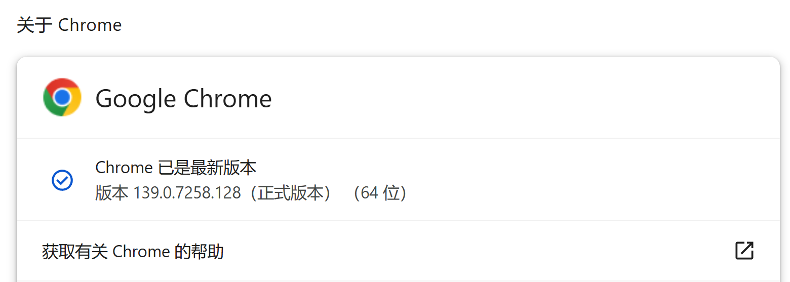
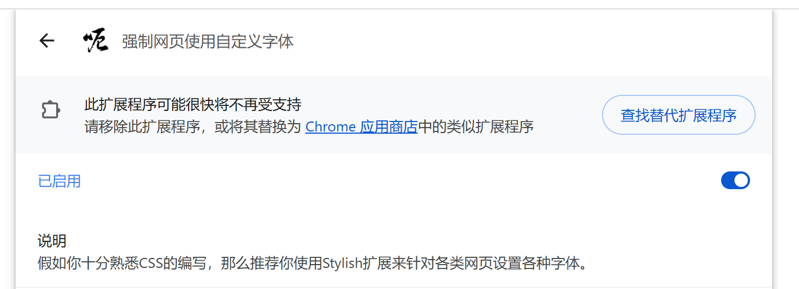

# 前言

:::tip[提示]
本文「扩展」=「扩展程序」= 「插件」。  
参考：https://blog.hentioe.dev/posts/continue-using-chrome-manifest-v2.html
:::

今天打开电脑，发现 Chrome 它阻止了一个扩展（如上图）。
查了一下，发现是 Google Chrome 已经永久停止了对 Manifest V2 扩展的支持，而且是已经计划了近4年的项目。在 2025年7月终于要落下帷幕**了**：

- [2022 年 1 月：Chrome 应用商店停止接受新的 Manifest V2 扩展程序](https://developer.chrome.com/docs/extensions/develop/migrate/mv2-deprecation-timeline?hl=zh-cn#january_2022_chrome_web_store_-_no_new_public_unlisted_extensions)
- [2022 年 6 月：Chrome 应用商店已停止接受将公开范围设置为“专用”的新 Manifest V2 扩展程序](https://developer.chrome.com/docs/extensions/develop/migrate/mv2-deprecation-timeline?hl=zh-cn#june_2022_chrome_web_store_-_no_new_private_extensions)
- [2024 年 6 月 3 日：Chrome 开始逐步淘汰 Manifest V2](https://developer.chrome.com/docs/extensions/develop/migrate/mv2-deprecation-timeline?hl=zh-cn#june_3rd_2024_the_manifest_v2_phase-out_begins)
- [2024 年 10 月 9 日：Chrome 扩展页面会向使用 Manifest V2 扩展程序的所有用户显示警告横幅](https://developer.chrome.com/docs/extensions/develop/migrate/mv2-deprecation-timeline?hl=zh-cn#october_9th_2024_an_update_on_manifest_v2_phase-out)
- [2025 年 3 月 31 日：停用 Manifest V2，但仍可以选择重新启用扩展程序](https://developer.chrome.com/docs/extensions/develop/migrate/mv2-deprecation-timeline?hl=zh-cn#march_31st_2025_manifest_v2_is_disabled_with_the_option_to_re-enable_extensions)
- [2025 年 7 月 24 日：在所有位置停用 Manifest V2](https://developer.chrome.com/docs/extensions/develop/migrate/mv2-deprecation-timeline?hl=zh-cn#jul_24th_2025_manifest_v2_is_disabled_everywhere)

**吗？**

# 解决方案
## 通过 chrome://flags 关闭
:::warning[注意]
目前并不能确认 Chrome 139.0.7258.128 之后的版本是否能继续使用此方法。但可以确定的是，稳定版 139.0.7258.128 能继续使用 Flags 控制开关。

:::

1. 地址栏输入 `chrome://flags/`。
2. 搜索 `temporary-unexpire-flags-m137`。
3. 将这个条目设置为 `Enabled`。
4. 重启浏览器。
5. 搜索 `extension-manifest-v2-deprecation-disabled`，将其设置为 `Disabled`。
6. 搜索 `extension-manifest-v2-deprecation-unsupported`，将其设置为 `Disabled`。
7. 重启浏览器，即可启用旧版扩展。

## 添加启动参数

1. 关闭 Chrome。
2. 打开 Chrome 的快捷方式属性。
3. 在 **目标** 后加上一个**空格**和 `--disable-features=ExtensionManifestV2Unsupported,ExtensionManifestV2Disabled`。
4. 点击 **确定**。
5. 再次双击 Chrome 快捷方式，打开 Chrome，即可启用旧版扩展（**暂时保留** 按钮将会出现）。 

## 换浏览器
### FireFox
[FireFox - 火狐](https://www.firefox.com/zh-CN/) 。它并**不**基于 Chromium ：[FireFox 常见问题](https://www.firefox.com/zh-CN/more/faq/) 。并且它将会 [继续支持 Manifest V2 扩展](https://blog.mozilla.org/addons/2024/03/13/manifest-v3-manifest-v2-march-2024-update/) 。~FireFox 这招太狠了~

---

# 其他
## Microsoft Edge
好吧，微软也放弃了其新 Edge 对 Manifest V2 的支持，强制关闭时间**待定**：[迁移到清单 V3 的概述和时间线 - Microsoft Edge Developer documentation | Microsoft Learn](https://learn.microsoft.com/zh-cn/microsoft-edge/extensions/developer-guide/manifest-v3) 。
