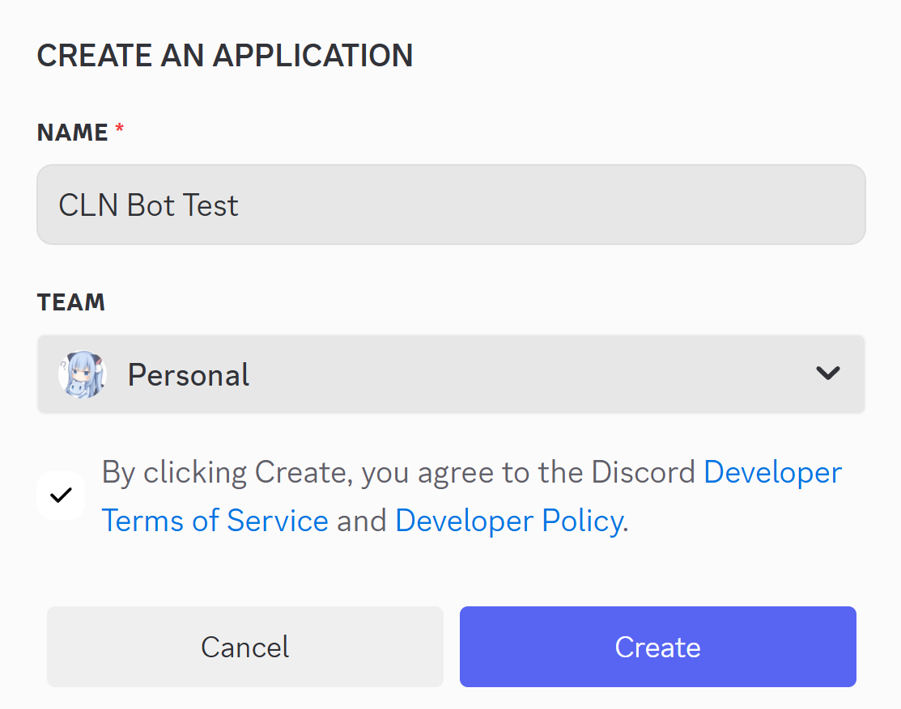
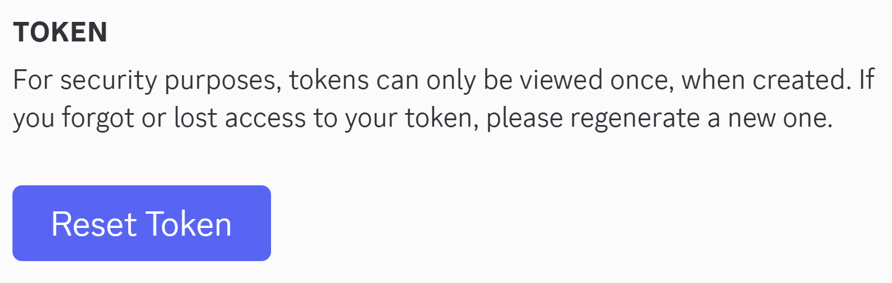
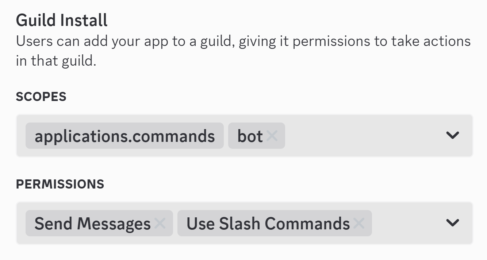
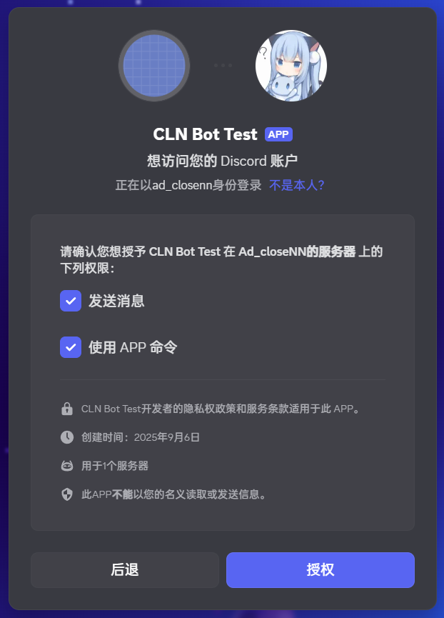
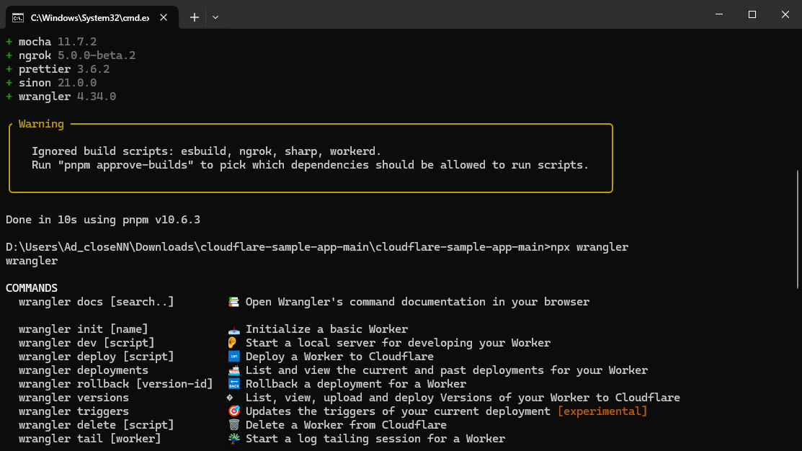
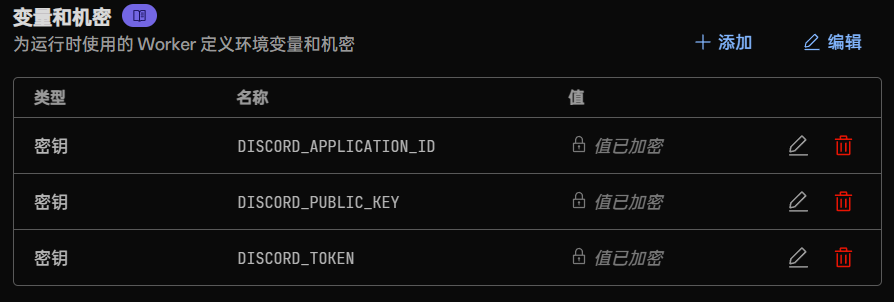
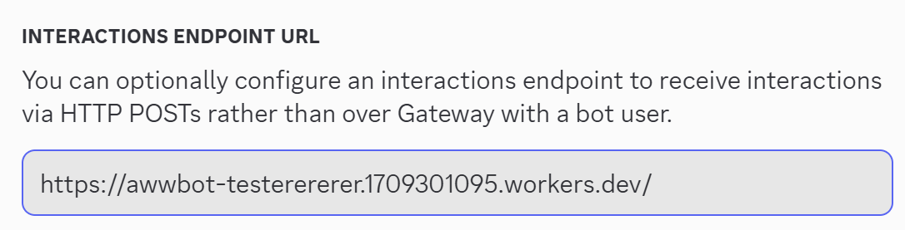
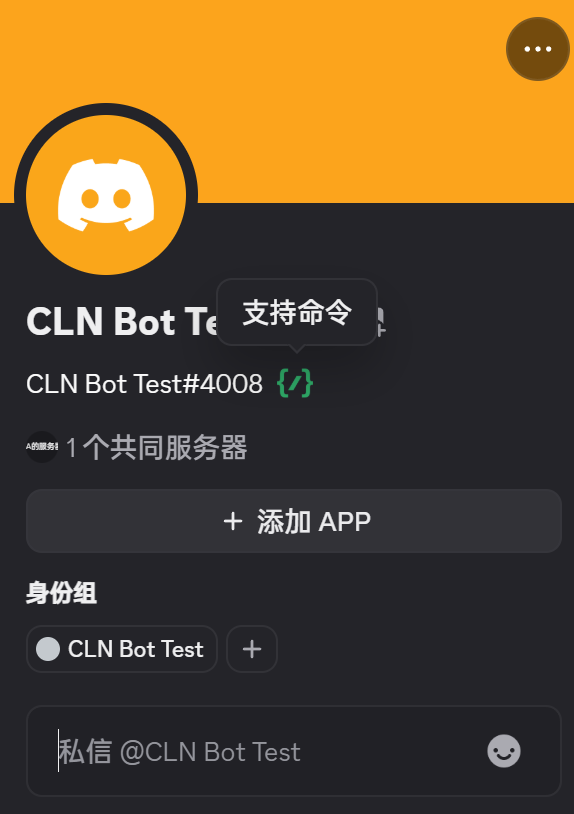
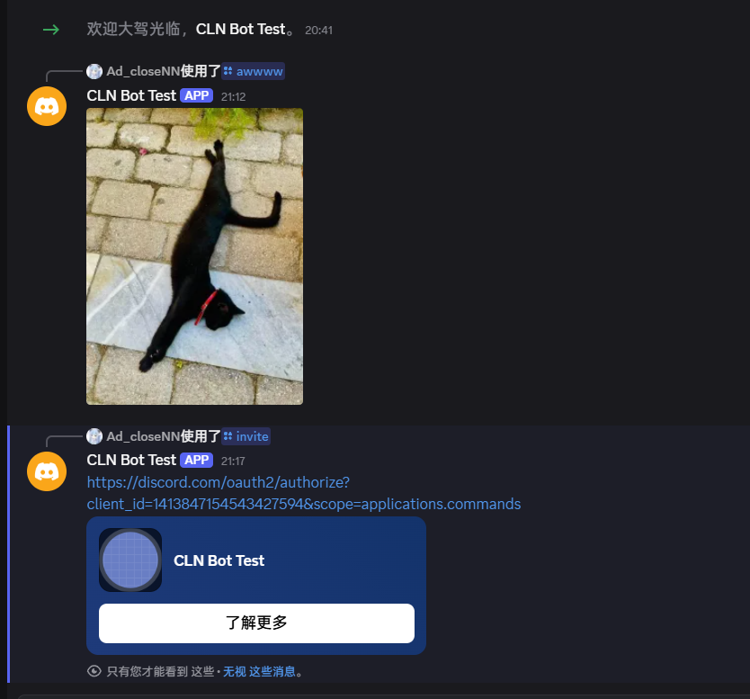

:::tip[提示]
~~赛博菩萨~~ Cloudflare Workers 不仅能运行 Discord 机器人，还能运行 Telegram 机器人。
:::

# 前言
众所周知，我们运行一个 Discord 机器人，可以通过 Python 第三方库 [discord.py](https://pypi.org/project/discord.py/) 来运行 Discord Bot。  
这听起来需要一个能一直运行的 Linux/Windows 服务器。但其实我们还能利用 Cloudflare Workers 来运行自己的机器人，而且还**大概率**不会被 Cloudflare 封号，因为 Discord 官方自己都放了[样例](https://github.com/discord/cloudflare-sample-app)：

::github{repo=discord/cloudflare-sample-app}

# 需求
1. 一个 [Cloudflare](https://dash.cloudflare.com) 账号
2. 一个 [Discord](https://discord.com) 账号
- （非必须）一个 [GitHub](https://github.com) 账号

# 创建 Discord 机器人
登录好 Discord 账号后，打开 https://discord.com/developers/applications ，点击右上角的 **New Application**，写下你 Bot 的名称，然后勾选协议，再点击蓝色按钮 **Create**： 

如果你[是人类](/posts/captcha/)，那么应该会顺利过完人机验证，创建一个新的 Discord Bot。在 **General Information** 页中，你可以添加 Bot 的头像、横幅、介绍、昵称等信息。

# 获取 Discord 机器人相关信息
:::caution[警告]
请务必将以下信息放置于安全的地方，且不要泄露 Token。
:::

## DISCORD_APPLICATION_ID
在默认页面 **General Information** 中，找到 `Application ID`，点击 **Copy** 按钮，粘贴到安全的地方。

## DISCORD_PUBLIC_KEY
在默认页面 **General Information** 中，找到 `Public Key`，点击 **Copy** 按钮，粘贴到安全的地方。

## DISCORD_TOKEN
在左侧选择 **Bot**，在页面内点击 **Reset Token** 按钮，将 Token 粘贴到安全的地方： 

# 配置 Discord 机器人设置
:::warning[注意]
这个方案会让**所有人**都可以把你的机器人安装到他们的服务器。前提是你的服务器内要有别人。
:::
在左侧选择 **Installation**，在下方 Guild Install 配置成如图所示的权限： 

配置完毕后点击上方 Install Link 中，右侧的 **Copy** 按钮，在浏览器内访问。  
在接下来的页面中选择 **添加至服务器**，然后选中一个服务器，点击 **继续**，点击 **授权**： 

当你的机器人出现在你所选的服务器中，那么代表你成功了。

# 配置 Cloudflare Worker
:::note[笔记]
这里以 [Cloudflare Wrangler](https://developers.cloudflare.com/workers/get-started/guide/) 操作 Worker 文件。如果需要上传到 GitHub，并用 Actions 提交 Worker 文件，请参考 [Deployment - Hosting a Reddit API Discord app on Cloudflare Workers](https://discord.com/developers/docs/tutorials/hosting-on-cloudflare-workers#deployment) 。
:::

点击链接下载最新的官方样例代码库： [https://github.com/discord/cloudflare-sample-app/archive/refs/heads/main.zip](https://github.com/discord/cloudflare-sample-app/archive/refs/heads/main.zip)

解压这个 `.zip` 压缩包到一个地方，然后安装依赖：

```shell title=pnpm
pnpm install
```

如果能用 `npx wrangler`，那就说明安装成功了： 

在文件夹根目录下有一个文件 `wrangler.toml`，打开它可以编辑你的 Worker 名字：

```toml title=wrangler.toml
name = "awwbot" <- 更改这个即可更改 Worker 的名字（不是更改 Discord 机器人的名字）
main = "./src/server.js"
compatibility_date="2023-05-18"

# [secrets]
# DISCORD_TOKEN
# DISCORD_PUBLIC_KEY
# DISCORD_APPLICATION_ID
```

接下来，我们需要将 Bot 的机密信息上传到 Cloudflare。
依次执行以下三个命令，值为之前在 [#获取 Discord 机器人相关信息](#获取-discord-机器人相关信息) 获取的三个信息：

```shell title=wrangler
npx wrangler secret put DISCORD_APPLICATION_ID

npx wrangler secret put DISCORD_PUBLIC_KEY

npx wrangler secret put DISCORD_TOKEN
```

如果你没有创建这个 Worker，Wrangler 会让你选择**是否创建名为xxx的 Worker**，这时输入y即可。

当三个密钥上传成功后，Worker 设置应该是如图所示的： 

不过，目前只上传了机密，并没有上传 Worker 主文件。所以会显示 "**There is nothing here yet**"。  
在终端输入以下命令可将本地 Worker 文件上传到 Cloudflare Workers：

```shell title=pnpm
pnpm run publish
```

正确的结果应为如下**类似**输出，`WARNING` 可以不用理：

```shell title="pnpm run publish"
 ⛅️ wrangler 4.34.0
───────────────────
Total Upload: 23.34 KiB / gzip: 6.27 KiB
Worker Startup Time: 2 ms
Uploaded awwbot-testerererer (7.46 sec)
▲ [WARNING] Worker has workers.dev disabled, but 'workers_dev' is not in the config.

  Using fallback value 'workers_dev = true'.


Deployed awwbot-testerererer triggers (5.40 sec)
  https://awwbot-testerererer.1709301095.workers.dev
Current Version ID: bbc5f582-58a9-4e30-94e1-d2a14952efa0
```

此时再访问 Worker，会出现类似 `👋 1413847154543427594` 的输出。这就说明 **Worker 配置成功了**。

# 其他配置
除此之外，还需要配置 Discord 的 Endpoint URL，将 Discord 和 Cloudflare Worker 打通：
1. 回到 Discord Developer，选择你的机器人。
2. 在 **General Information** 中，找到 **Interactions Endpoint URL**。
3. 将**你部署的 Cloudflare Worker 的链接**填进去，如图所示（实际请替换为自己的）： 
4. 点击 **Save Changes** 按钮，保存更改。

还有还有，你还需要向 Discord 注册机器人的命令。  
1. 回到文件夹根目录，把 `example.dev.vars` 重命名为 `.dev.vars`。
2. 打开这个文件，填入之前获取的三个信息。
```ini title=.dev.vars
DISCORD_APPLICATION_ID: ".."
DISCORD_PUBLIC_KEY: ".."
DISCORD_TOKEN: ".. <- 记得补上这个缺失的引号！这是 Discord 官方漏的
```
https://github.com/discord/cloudflare-sample-app/blob/main/example.dev.vars#L3  
:::caution[警告：别怪我没提醒你]
这个文件 `.dev.vars` 请勿上传至 GitHub 的**公开**存储库，否则会面临 TOKEN 泄露的风险！
:::
3. 保存那个文件，然后在终端输入：
```shell title=pnpm
pnpm run register
```
4. 当出现 `Registered all commands` 时代表注册命令成功。

回到 Discord，乱点一下你的机器人，比如添加 APP 然后添加到自己什么的，或者发送一条消息给它，总之触发了 **{/}** 这个代表成功了：

可能会显示离线，但是如果命令能用就代表能用了。 

# 关于今后...
关于配置更多的命令，`.src/`中的 `commands.js` `register.js` `server.js` 是重要的，不会配置的问 AI 就好了。这就纯纯复制粘贴和 AI。