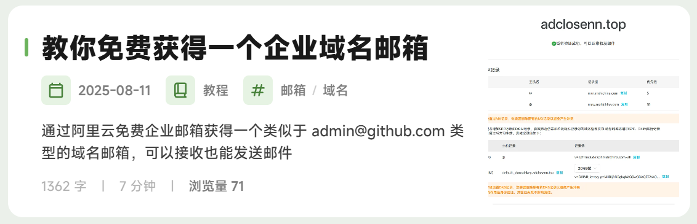

# 前言
如果你用的博客是 [Astro](https://astro.build) 或以它为架构的 [Fuwari](https://github.com/saicaca/fuwari)，那么这篇文章或许适合。  

这篇文章的目的是 **在 Markdown 文件的顶端加入一个自定义的类似 `draft: true` 这类变量控制器**，可以运用它对某些组件进行更改，包括关闭、更改。例如，当你在 fuwari 中的 Markdown 顶端定义一个内置参数 `image`，你可以通过写 `image: "../assets/images/custom-frontmatter-cover.svg"` 来让这篇文章在**博客主页**获得一个图片（而不定义就只有一个 `>` 的按钮）： 

如果你足够细心，你会发现文章 [你是人类吗？](/posts/captcha/) 的图片在**博客主页**和**文章内部**是不同的。这也用到了自定义 Frontmatter，自己定义了不同的地方该显示什么图片。

# 定义 Frontmatter
:::tip[提示]
如果你使用的也是 Astro Fuwari，那么这些操作理应是**相同**且**可用**的。
:::

打开 `src/content/config.ts` 文件，在 `const postsCollection = defineCollection({` 部分，参考已有的示例定义一个**不重名**的参数，以下是本站的：

**boolen**：布尔值。可以通过 `true` 和 `false` 控制。  
**string**：字符串。填写的是一串文本。

最后面括号中的 `true` 指的是如果 Markdown 文件顶端的 Frontmatter 里**没有**这个参数，就默认为 `true`。`string` 也同理。

```ts title="src/content/config.ts" {11-12}
const postsCollection = defineCollection({
	schema: z.object({
		title: z.string(),
		published: z.date(),
		updated: z.date().optional(),
		draft: z.boolean().optional().default(false),
		description: z.string().optional().default(""),
		image: z.string().optional().default(""),
		tags: z.array(z.string()).optional().default([]),
		category: z.string().optional().nullable().default(""),
		showcover: z.boolean().optional().default(true),
		customcover: z.string().optional().default(""),

		lang: z.string().optional().default(""),

		/* For internal use */
		prevTitle: z.string().default(""),
		prevSlug: z.string().default(""),
		nextTitle: z.string().default(""),
		nextSlug: z.string().default(""),
	}),
});
```

# 配置 Frontmatter（样例）
## 关闭文章头图
默认你使用 `image` 定义了一张图片，那么这张图片将会同时显示在**博客主页**和 **文章内部（那个大大的图片，位于文章之首）**。  
如不需要使用**博客主页**那张图片作为文章内部的照片，我们可以**关闭文章内部的头图显示，只剩下文章正文和文章的图片，而博客主页那个卡片右边的图片依然显示**。

打开 `src/pages/posts/[...slug].astro`，（这个可选：在**第二处** `---` 上面加入 `const 随便一个不重复名字 = entry.data.你在#定义 Frontmatter定义的参数。` ，本站是 `showcover = enrty.data.showcover;`）  
找到 `{entry.data.image &&`，将其改为 `{entry.data.showcover && entry.data.image &&`。如图所示：

:::warning[注意]
1. 如果你做了上面的可选步骤（定义了一个变量），那么可以将其改为 `{变量名 && entry.data.image &&`。
2. 如果你**没有使用**在 [#定义 Frontmatter](#定义-frontmatter) 中的本站自定义的参数，这里就无法使用 entry.data.showcover。
:::

```astro title="src/pages/posts/[...slug.astro]" {1}
            {entry.data.showcover && entry.data.image &&
                <ImageWrapper id="post-cover" src={entry.data.image} basePath={path.join("content/posts/", getDir(entry.id))} class="mb-8 rounded-xl banner-container onload-animation"/>
            }
```
## 自定义文章内部头图
你也看到了，本文在博客主页和本页的头图不一样。这是自定义了头图 `customcover: ../assets/images/custom-frontmatter-customcover.svg`。

打开 `src/pages/posts/[...slug].astro`，（这个可选：在**第二处** `---` 上面加入 `const 随便一个不重复名字 = entry.data.你在#定义 Frontmatter定义的参数。`，本站是 `const customcover = entry.data.customcover;`）  
找到 `{entry.data.image &&` 开头的元素，在其下面添加一个和其**一模一样**的元素。如图所示：

:::warning[注意]
1. 如果你做了上面的可选步骤（定义了一个变量），那么可以将其改为 `{变量名 &&`。
2. 如果你**没有使用**在 [#定义 Frontmatter](#定义-frontmatter) 中的本站自定义的参数，这里就无法使用 entry.data.customcover。
:::

```astro title="src/pages/posts/[...slug.astro]" {6}
            {entry.data.showcover && entry.data.image &&
                <ImageWrapper id="post-cover" src={entry.data.image} basePath={path.join("content/posts/", getDir(entry.id))} class="mb-8 rounded-xl banner-container onload-animation"/>
            }
            
            <!-- 自制内部头图 customcover-->
            {entry.data.customcover &&
                <ImageWrapper id="post-cover" src={entry.data.customcover} basePath={path.join("content/posts/", getDir(entry.id))} class="mb-8 rounded-xl banner-container onload-animation"/>
            }
```

---

# 附加：本站 [...slug].astro 文件

:::CAUTION[不要照抄，除非你知道自己在做什么]
:::

```astro title="src/pages/posts/[...slug].astro" {49,52}
---
import path from "node:path";
import License from "@components/misc/License.astro";
import Markdown from "@components/misc/Markdown.astro";
import I18nKey from "@i18n/i18nKey";
import { i18n } from "@i18n/translation";
import MainGridLayout from "@layouts/MainGridLayout.astro";
import { getSortedPosts } from "@utils/content-utils";
import { getDir, getPostUrlBySlug } from "@utils/url-utils";
import { Icon } from "astro-icon/components";
import { licenseConfig } from "src/config";
import ImageWrapper from "../../components/misc/ImageWrapper.astro";
import PostMetadata from "../../components/PostMeta.astro";
import { profileConfig, siteConfig } from "../../config";
import { formatDateToYYYYMMDD } from "../../utils/date-utils";

export async function getStaticPaths() {
	const blogEntries = await getSortedPosts();
	return blogEntries.map((entry) => ({
		params: { slug: entry.slug },
		props: { entry },
	}));
}

const { entry } = Astro.props;
const { Content, headings } = await entry.render();

const { remarkPluginFrontmatter } = await entry.render();

const jsonLd = {
	"@context": "https://schema.org",
	"@type": "BlogPosting",
	headline: entry.data.title,
	description: entry.data.description || entry.data.title,
	keywords: entry.data.tags,
	author: {
		"@type": "Person",
		name: profileConfig.name,
		url: Astro.site,
	},
	datePublished: formatDateToYYYYMMDD(entry.data.published),
	inLanguage: entry.data.lang
		? entry.data.lang.replace("_", "-")
		: siteConfig.lang.replace("_", "-"),
	// TODO include cover image here
};

// 获取头图 boolean，无需设置 true
const showcover = entry.data.showcover;

// 获取自定义的头图（Markdown 内部）
const customcover = entry.data.customcover;

---
<MainGridLayout banner={entry.data.image} title={entry.data.title} description={entry.data.description} lang={entry.data.lang} setOGTypeArticle={true} headings={headings}>
    <script is:inline slot="head" type="application/ld+json" set:html={JSON.stringify(jsonLd)}></script>
    <div class="flex w-full rounded-[var(--radius-large)] overflow-hidden relative mb-4">
        <div id="post-container" class:list={["card-base z-10 px-6 md:px-9 pt-6 pb-4 relative w-full ",
            {}
        ]}>
            <!-- word count and reading time -->
            <div class="flex flex-row text-black/30 dark:text-white/30 gap-5 mb-3 transition onload-animation">
                <div class="flex flex-row items-center">
                    <div class="transition h-6 w-6 rounded-md bg-black/5 dark:bg-white/10 text-black/50 dark:text-white/50 flex items-center justify-center mr-2">
                        <Icon name="material-symbols:notes-rounded"></Icon>
                    </div>
                    <div class="text-sm">{remarkPluginFrontmatter.words} {" " + i18n(I18nKey.wordsCount)}</div>
                </div>
                <div class="flex flex-row items-center">
                    <div class="transition h-6 w-6 rounded-md bg-black/5 dark:bg-white/10 text-black/50 dark:text-white/50 flex items-center justify-center mr-2">
                        <Icon name="material-symbols:schedule-outline-rounded"></Icon>
                    </div>
                    <div class="text-sm">
                        {remarkPluginFrontmatter.minutes} {" " + i18n(remarkPluginFrontmatter.minutes === 1 ? I18nKey.minuteCount : I18nKey.minutesCount)}
                    </div>
                </div>
            </div>

            <!-- title -->
            <div class="relative onload-animation">
                <div
                    data-pagefind-body data-pagefind-weight="10" data-pagefind-meta="title"
                    class="transition w-full block font-bold mb-3
                    text-3xl md:text-[2.25rem]/[2.75rem]
                    text-black/90 dark:text-white/90
                    md:before:w-1 before:h-5 before:rounded-md before:bg-[var(--primary)]
                    before:absolute before:top-[0.75rem] before:left-[-1.125rem]
                ">
                    {entry.data.title}
                </div>
            </div>

            <!-- metadata -->
            <div class="onload-animation">
                <PostMetadata
                        class="mb-5"
                        published={entry.data.published}
                        updated={entry.data.updated}
                        tags={entry.data.tags}
                        category={entry.data.category}
                ></PostMetadata>
                {!entry.data.image && <div class="border-[var(--line-divider)] border-dashed border-b-[1px] mb-5"></div>}
            </div>

            <!-- always show cover as long as it has one -->
            <!-- 使用自制 showcover 控制器控制头图的出现 -->
            {showcover && entry.data.image &&
                <ImageWrapper id="post-cover" src={entry.data.image} basePath={path.join("content/posts/", getDir(entry.id))} class="mb-8 rounded-xl banner-container onload-animation"/>
            }
            
            <!-- 自制内部头图 customcover-->
            {customcover &&
                <ImageWrapper id="post-cover" src={entry.data.customcover} basePath={path.join("content/posts/", getDir(entry.id))} class="mb-8 rounded-xl banner-container onload-animation"/>
            }

            <!-- 头图调试代码
            <pre>
            showcover（变量）: {showcover} (type: {typeof showcover})
            entry.data.showcover: {entry.data.showcover} (type: {typeof entry.data.showcover})
            </pre>
            -->

            <Markdown class="mb-6 markdown-content onload-animation">
                <Content />
            </Markdown>

            {licenseConfig.enable && <License title={entry.data.title} slug={entry.slug} pubDate={entry.data.published} class="mb-6 rounded-xl license-container onload-animation"></License>}

        </div>
    </div>

    <div class="flex flex-col md:flex-row justify-between mb-4 gap-4 overflow-hidden w-full">
        <a href={entry.data.nextSlug ? getPostUrlBySlug(entry.data.nextSlug) : "#"}
           class:list={["w-full font-bold overflow-hidden active:scale-95", {"pointer-events-none": !entry.data.nextSlug}]}>
            {entry.data.nextSlug && <div class="btn-card rounded-2xl w-full h-[3.75rem] max-w-full px-4 flex items-center !justify-start gap-4" >
                <Icon name="material-symbols:chevron-left-rounded" class="text-[2rem] text-[var(--primary)]" />
                <div class="overflow-hidden transition overflow-ellipsis whitespace-nowrap max-w-[calc(100%_-_3rem)] text-black/75 dark:text-white/75">
                    {entry.data.nextTitle}
                </div>
            </div>}
        </a>

        <a href={entry.data.prevSlug ? getPostUrlBySlug(entry.data.prevSlug) : "#"}
           class:list={["w-full font-bold overflow-hidden active:scale-95", {"pointer-events-none": !entry.data.prevSlug}]}>
            {entry.data.prevSlug && <div class="btn-card rounded-2xl w-full h-[3.75rem] max-w-full px-4 flex items-center !justify-end gap-4">
                <div class="overflow-hidden transition overflow-ellipsis whitespace-nowrap max-w-[calc(100%_-_3rem)] text-black/75 dark:text-white/75">
                    {entry.data.prevTitle}
                </div>
                <Icon name="material-symbols:chevron-right-rounded" class="text-[2rem] text-[var(--primary)]" />
            </div>}
        </a>
    </div>

</MainGridLayout>
```