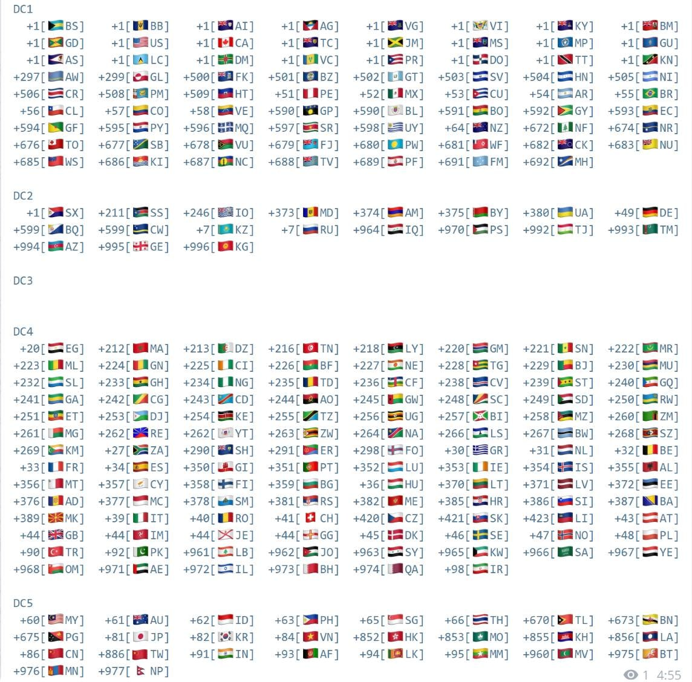
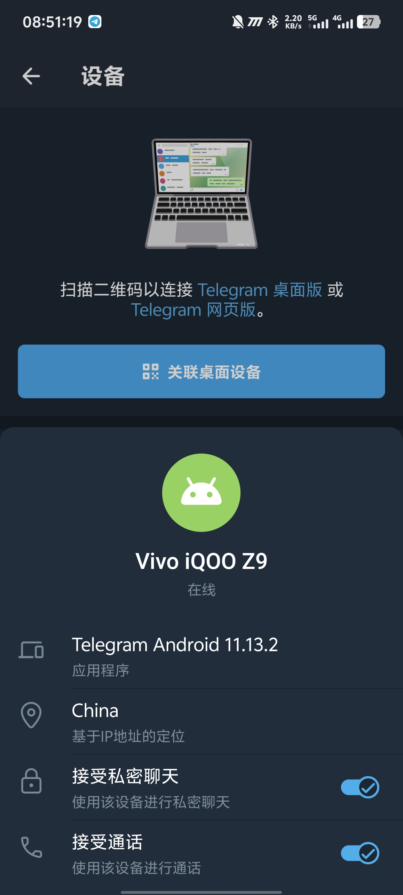
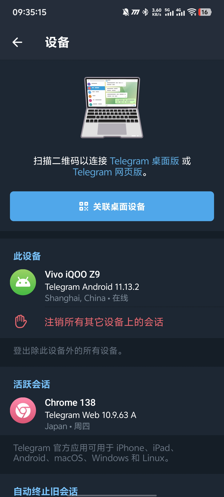
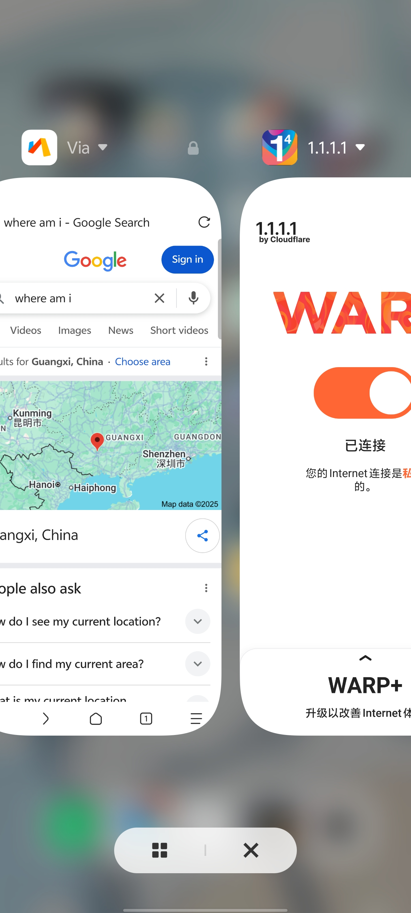
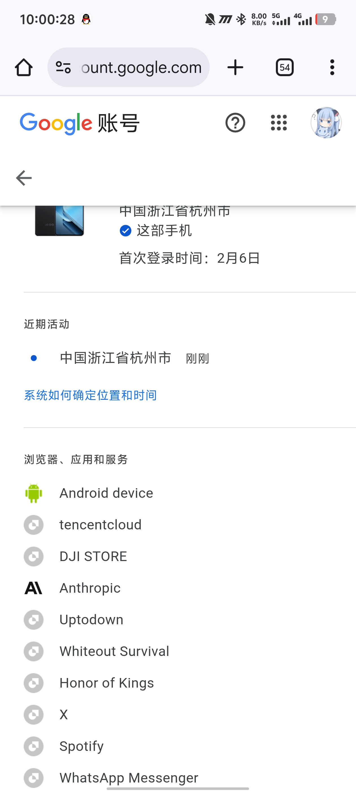

# Telegram 能直连了？
### 目前已被墙
[t.me/zaihuapd/34943](https://t.me/zaihuapd/34943)
```
今早部分地区 GFW 放松了对 Telegram DC5 的封锁

根据多位 TG 用户测试，目前 Telegram DC5 可以在部分地区直接连接，而无需通过任何代理。

这可能是 Telegram 所在 IP 进行变更，GFW 未及时更新响应导致。

请问各位所在地区是否可以直连？

群友补充：DC5 数据中心和官网都很绿

群友目前反馈，已经无法直连
```

:::note
仅 DC5（数据中心） 用户（包括手机号+86）可直连

:::

8月8日早上 6:40 **之前**，GFW 放开了对 Telegram 的限制。不幸的是，仅仅几小时的 9:30 左右，GFW 已再次封禁 Telegram 的访问。 ~~默哀~~

## 除此之外
另外，再扯一个 Cloudflare Warp，它具有国内直连节点。概率连上后，Google 将会显示国内 Cloudflare Warp IP。

# 合影留念
- Telegram **China** IP： 
- Telegram **中国上海市** IP：（错误的定位） 

---

- Google **广西** IP（Cloudflare Warp）： 
- Google **中国浙江省杭州市** IP（错误的定位，Cloudflare Warp）： 