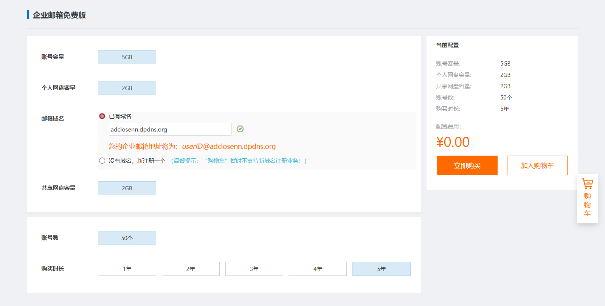
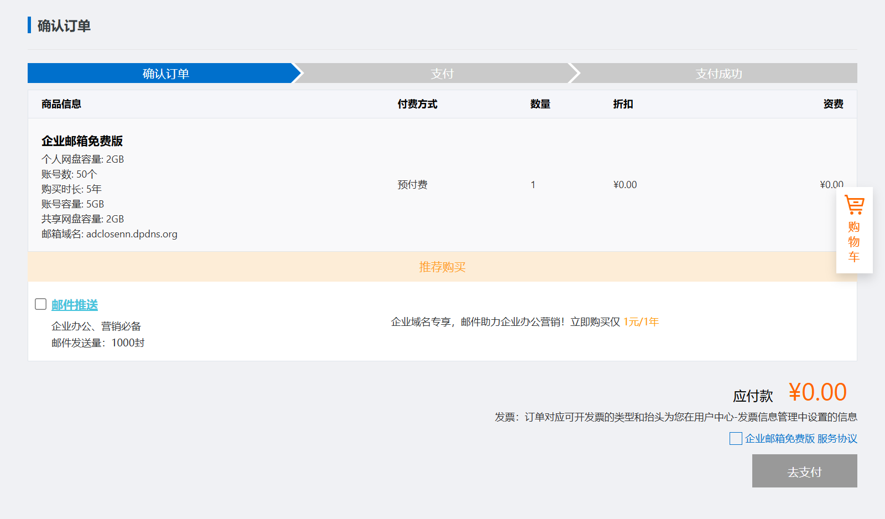
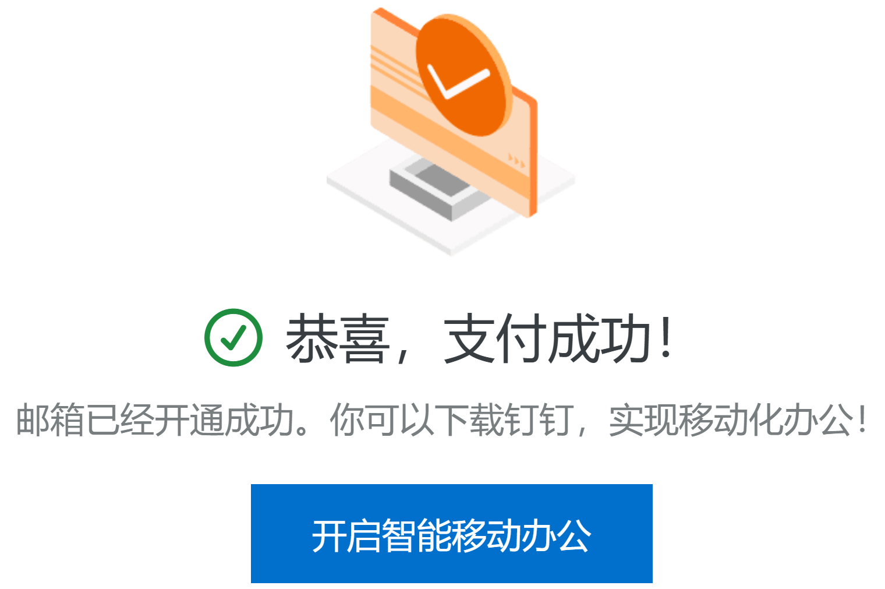
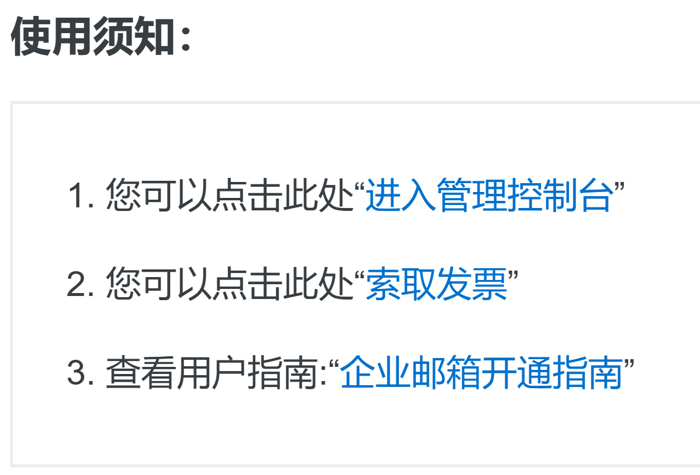
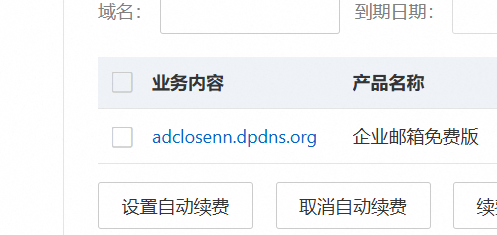
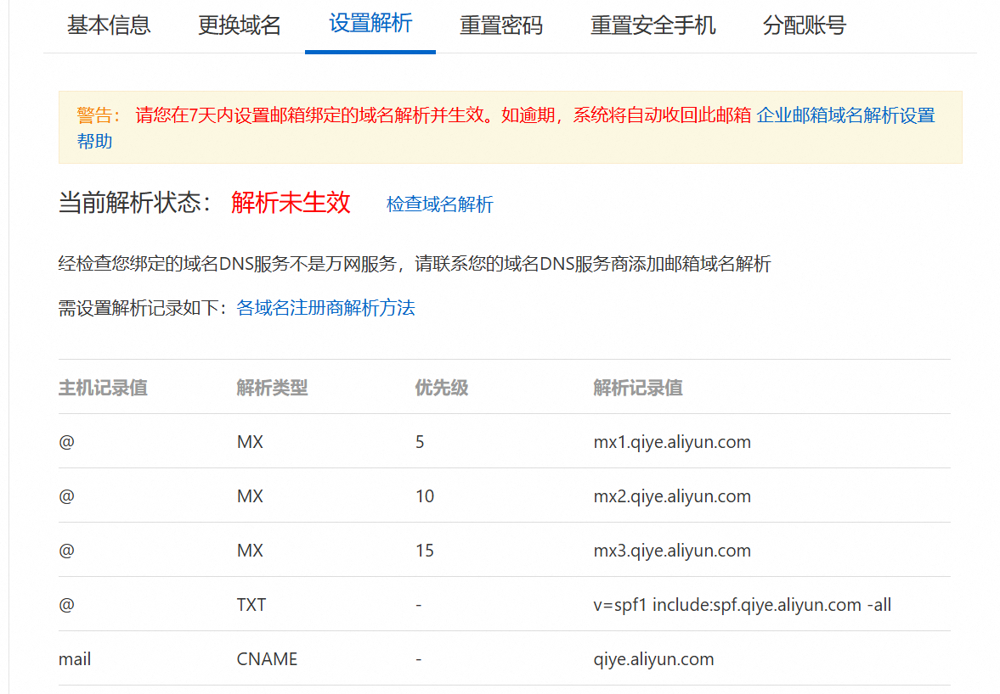
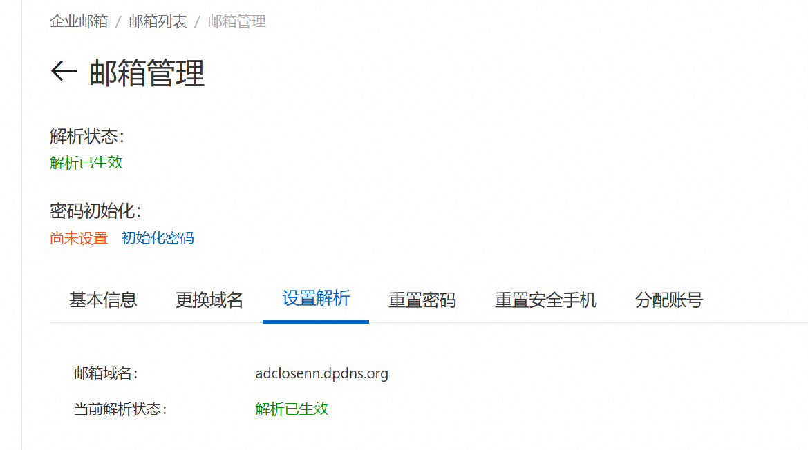
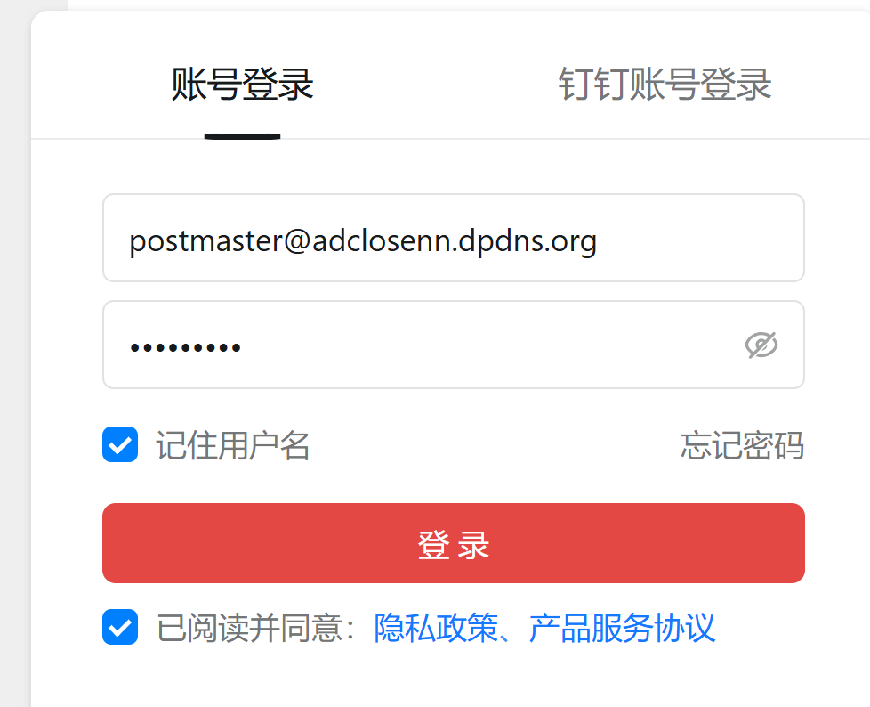
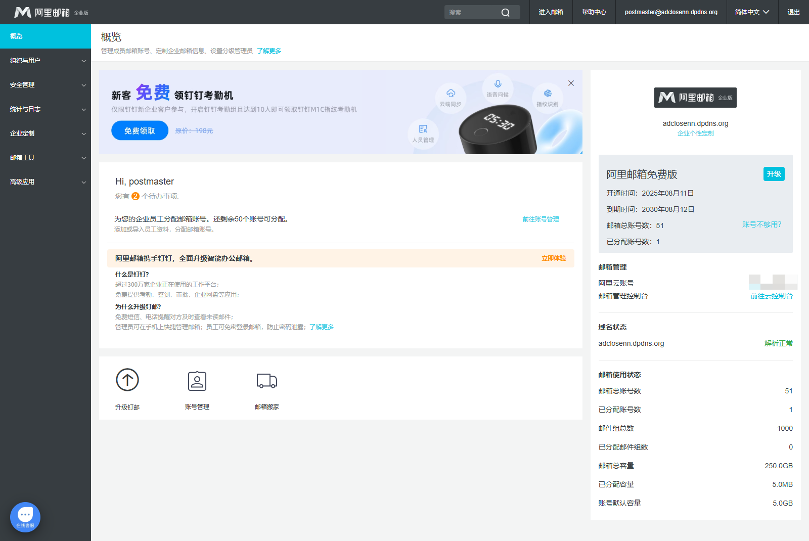
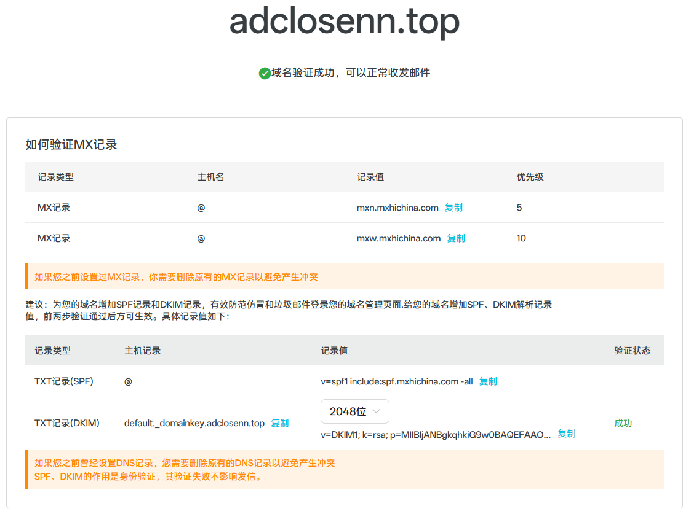

# 前言
自从你上网冲浪接触邮箱以来，你或多或少都会见过这种邮箱：
- noreply@github.com
- notifications@github.com
- microsoft-noreply@microsoft.com
- noreply@steampowered.com
- account-security-noreply@accountprotection.microsoft.com
- 等如类似 xxx@qq.com, xxx@bilibili.com
- ...

这些邮箱都是**企业或组织自己域名**的邮箱，可以很清楚地体现出这封邮件来自哪个企业/组织。  
那么，当我们普通人获得了一个域名，也能用这种自己域名的邮箱吗？答案是能的，可以用阿里云或网易的**免费企业邮箱**，全免费，能用 IMAP/POP 和 SMTP 服务器给第三方邮箱客户端使用。

:::warning[注意]
本篇教程讲的获取邮箱的方法为**阿里云国内站**，如果需要使用**网易**的免费企业邮箱，请移步至 [2x.nz/posts/163-free-domain-email/](https://2x.nz/posts/163-free-domain-email/)
:::

# 限制
推荐查看 [普通账号常见参数 - 阿里云](https://help.aliyun.com/document_detail/439236.html) 。

- 单账号可存储总邮件数：200 万封。
- 单账号个人网盘空间：5 GB。
- 每日最大发件数：**未考察**，可能是一个域名用户(a@b.com) 200 封/天；可能是一个域名(*@b.com) 200 封/天。

# 需求
1. 一个**已实名**的 [阿里云](https://www.aliyun.com) 账号（不实名无法购买：`您还未实名认证，请务必先前往本页面右上角个人中心进行实名认证。`）。
	- 阿里云仅支持 14 岁以上通过**扫描支付宝二维码**、**支付宝扫描脸部**、**上传身份证正反面照片**进行实名认证。
	- 以下信息来自 [阿里云](https://help.aliyun.com/zh/account/user-guide/individual-identities?spm=a2c4g.11186623.help-menu-35469.d_2_0_2_1.6fcc689dZlafVI) ：
	- 通过支付宝账号进行实名认证并不会自动将该支付宝账号与阿里云账号绑定用于支付。如果您希望在阿里云上使用支付宝进行支付，您仍需要手动将阿里云账号与您的支付宝账号进行绑定。
	- 绑定用于支付的支付宝账号可以是实名认证时使用的支付宝账号，也可以是其他支付宝账号。
	- 阿里云App仅支持个人支付宝授权认证。

2. 一个域名，可以为**不是从阿里云购买**的域名（如 Spaceship、Namesilo），实测 `dpdns.org` 域名也可以使用。
3. 一个能接收验证码的手机号。

# 开通企业邮服务
## 订购服务
1. 访问 [阿里邮箱](https://exmail.aliyun.com/free) ，滑到下面点击 **立即抢购**，将会跳转到阿里云，如果阿里云未登录请登录。
2. 在订购页面选择必要配置，完成后点击 **立即购买**：
	- 选择 **已有域名**，填入自己的域名，填完后往空白处点一下。`dpdns.org` 也可以用。
	- 购买时长选择 **5年**。
	
3. 如果你要纯免费，请**不要**勾选 **邮件推送**（默认未勾选）。阅读完 **企业邮箱免费版 服务协议** 后，勾选它，并点击 **去支付**。 
4. 无需添加支付方式，点击右下角 **支付** 即可。
5. 如果看到这个页面，代表你**成功**地开通了企业邮服务。 

## 设置前置配置
1. 在下方 **使用须知** 中找到 **进入管理控制台**，点击进入。 
2. 点击刚刚填写的域名 
3. 点击 **设置解析**，将阿里云给出的 MX 等记录填入你的域名 DNS 提供商（我的是 Cloudflare）。完成后等待 DNS 记录的传播，然后点击 **检查域名解析**，如果出来的是绿色的**解析已生效**，证明你的 DNS 记录添加成功。  
4. 接着在 **重置密码** 处设置一个管理员登录密码。**密码长度8-64位，须同时包含大写、小写字母、数字、特殊字符中的任意三种，不能含有账号**。
5. 复制 **基本信息/管理员账号** 的地址，为 postmaster@你的域名。

## 设置邮箱配置
1. 点击进入 <a href="https://qiye.aliyun.com" target="_blank">阿里邮箱登录入口</a> ，用户名为刚才复制的管理员账号，密码为 [#设置前置配置](#设置前置配置) 中第 4 步创建的密码。 
2. 如果遇到**需要绑定手机号**，请绑定。
3. 成功后会来到这个界面。 
4. 来到左侧菜单，展开 **组织与用户**，点击 **员工账号管理**，填写用户信息。设置好后点击 **保存** ：
	- 姓名：随便填。
	- 默认邮件地址：填写你想用的名字。例如，我想用 `i@adclosenn.top` 收发邮件，那么 **默认邮件地址** 就应填写 `i`。
	- 安全手机：可以不填。
	- 开启POP3/SMTP服务：如果你需要使用第三方邮箱客户端（如 QQ邮箱、163邮箱、Gmail、Outlook），请**勾选**。
	- 开启IMAP/SMTP服务：如果你需要使用第三方邮箱客户端（如 QQ邮箱、163邮箱、Gmail、Outlook），请**勾选**。
	- 初次登录修改密码：**不建议**开启。
5. 来到左侧菜单，展开 **企业定制**，点击 **域名管理**，点击上方 **检查MX解析**，查看最下面的 **TXT记录(DKIM)**，如果验证是**失败**，则去 DNS 提供商内填写 TXT 记录信息。成功后会如图所示。如果之前曾经设置过其他邮箱提供商的 DNS 记录，需要删除原有的 DNS 记录，以避免产生冲突。 

# 使用企业邮箱
## 直接使用邮箱
如果你希望直接使用阿里邮箱首发短信，**而不是**通过QQ邮箱、163邮箱、Gmail等第三方客户端代收发邮件，那么可以直接点击右上角的 **退出登录** 退出 postmaster 账户。  
打开 <a href="https://qiye.aliyun.com/alimail/auth/login" target="_blank">qiye.aliyun.com/alimail/auth/login</a> ，登录你刚刚创建好的用户，然后收发邮件。