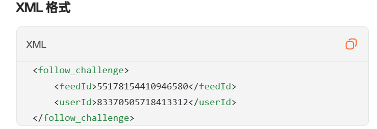

# 前言
:::tip[提示]
Folo 也就是之前的 Follow，只不过改名成了 Folo。
:::

如你所见，这是 Folo 的订阅源认证卡片，代表着这个 RSS 订阅源未经认证（没有与**订阅源提供者**的 Folo 账户进行绑定）。  
所以我们现在的目标是 **将订阅源与自己的 Folo 账户绑定，认证这个订阅源** 。

以下**会有 3 种认证方式**可选：**纯文本**、**描述**、**RSS 标签**，请根据自己的博客框架或 RSS 生成器选择。  

**RSS 标签** 这种方法适用于悄无声息地认证。  
**纯文本** 这种方法适合大部分博客。

本站使用 [RSS 标签](#rss-标签) 方法进行订阅源认证：[rss.xml](https://adclosenn.top/rss.xml) 。

# 纯文本认证
这种方法极其简单，你只需要发一篇文章到你的博客或者其他平台即可。本质上就是通过读取你的 RSS 订阅文件，查看里面是否有 Folo 给出的文本。所以认证文本**必须**要可在 RSS 订阅文件找到。  
[https://adclosenn.top/rss.xml](https://adclosenn.top/rss.xml) 这个是本站的 RSS 订阅源地址，你可以在最下面的 Footer 处找到。

你需要将类似如这串文本（可在 Folo 中复制）粘贴到你的文章中（不要使用我的，每个人的都不一样）：

```
This message is used to verify that this feed (feedId:177350379949135872) belongs to me (userId:83370505718413312). Join me in enjoying the next generation information browser https://folo.is.
```

# 描述认证
也就是 Folo 认证卡片中的中间那个。  
这个方法需要把认证语句添加到 RSS 生成器的 `<description></description>` 处。  
如果你使用的和本站相同框架 [Astro](https://astro.build) ，那么可以到 `src/config.ts`，在 `subtitle` 添加认证语句。

```ts
export const siteConfig: SiteConfig = {
	title: "Ad_closeNN 的小站",
	subtitle: "Ad_closeNN の 小站，时不时会刷新一些野生东西 | ✨ 欢迎友链，天天开心！ ✨ | feedId:177350379949135872+userId:83370505718413312",
	lang: "zh_CN", // Language code, e.g. 'en', 'zh-CN', 'ja', etc.
}
```


:::note[代码来源]

```ts title="src/pages/rss.xml.ts" {3}
	return rss({
		title: siteConfig.title,
		description: siteConfig.subtitle || 'No description',
		site: context.site,
		items: feed,
        ...
    })
```
:::

# RSS 标签
如果你使用的和本站相同框架 [Astro](https://astro.build) ，那么可以到 `src/config.ts` 中的第 6 行，在 `</language>` 后添加 `<follow_challenge></follow_challenge>` 进行认证：


```ts title="src/pages/rss.xml.ts" {6}
	return rss({
		title: siteConfig.title,
		description: siteConfig.subtitle || 'No description',
		site: context.site,
		items: feed,
		customData: `<language>${siteConfig.lang}</language><follow_challenge><feedId>177350379949135872</feedId><userId>83370505718413312</userId></follow_challenge>`,
	});
```



# 结束
写完并 push，等网站部署完毕后，点击 Folo 右下加的 **验证** 按钮，如果通过即为**验证成功**，恭喜你。