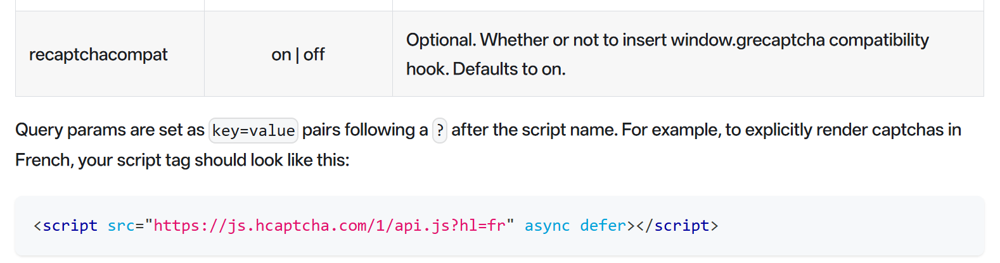
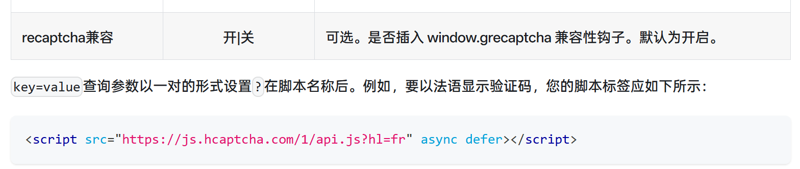
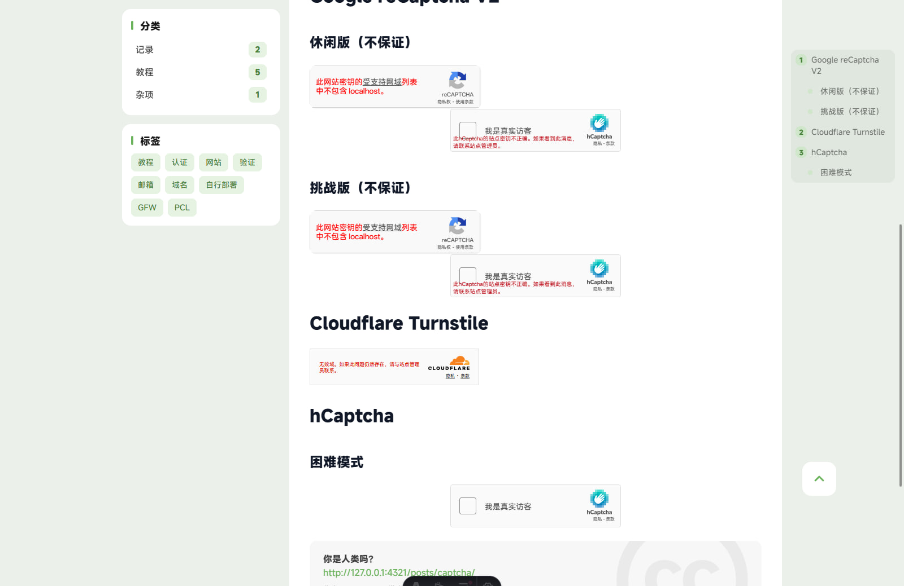

# 强兼 Google reCaptcha 失败？
如你所见，这是 hCaptcha 无法验证的样子。当然，如果你在一个页面同时放上 [Google reCaptcha](https://developers.google.com/recaptcha?hl=zh-cn)（我的是 v2）和 [hCaptcha](https://www.hcaptcha.com)，那么聪明的 hCaptcha 会 [开始兼容它](https://docs.hcaptcha.com/configuration) 。


**译文：**  


---

[posts/captcha/](/posts/captcha/)  
而开启后却是这样的：


没错，出现了 3 个 hCaptcha 框。而且出现的位置就在 reCaptcha 的位置。哇，强兼失败？

byd 太气人了这。

---

# 解决方法
将 hCaptcha 的脚本请求 URL 加上 `?recaptchacompat=off` 即可：
```html
<script 
    src="https://hcaptcha.com/1/api.js?recaptchacompat=off" async defer>
</script>
```