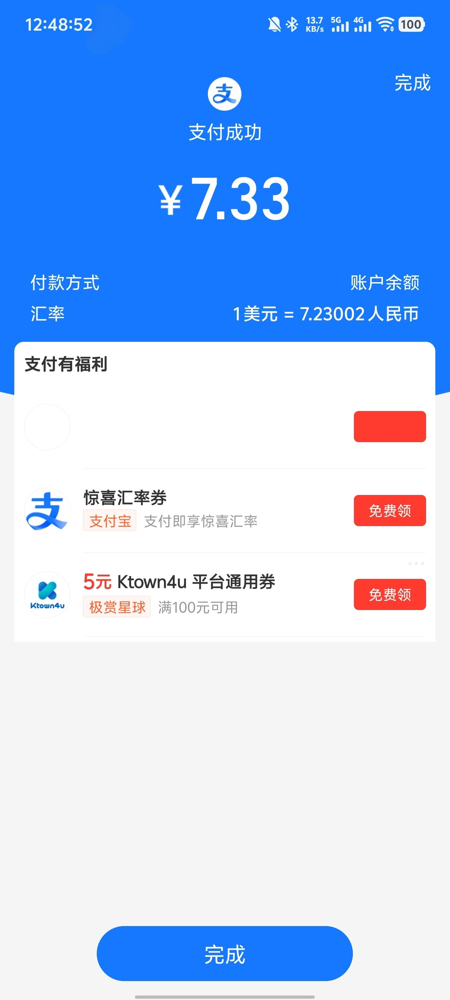
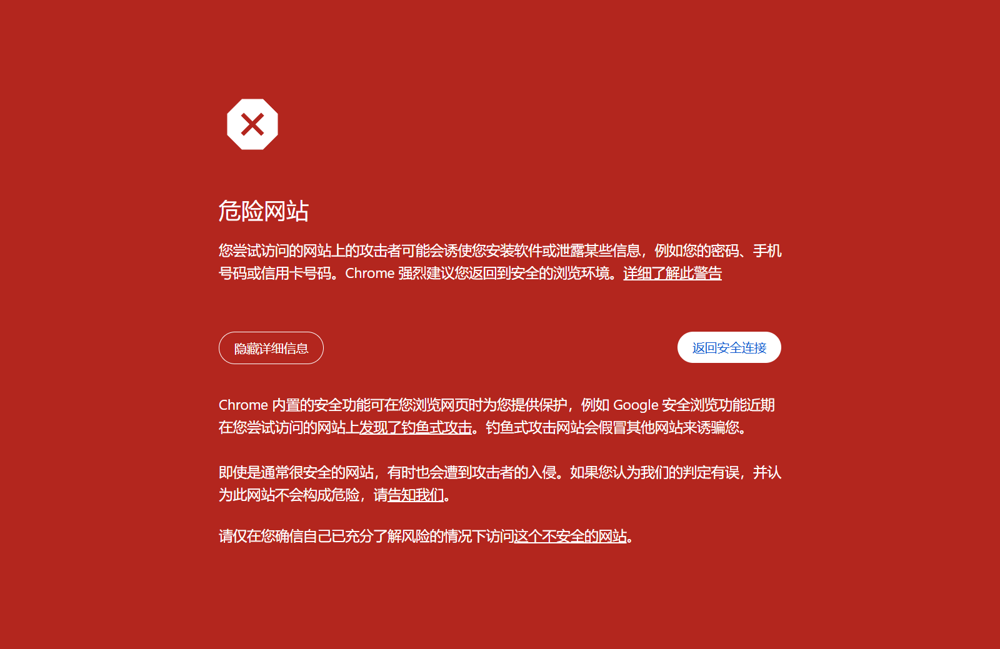
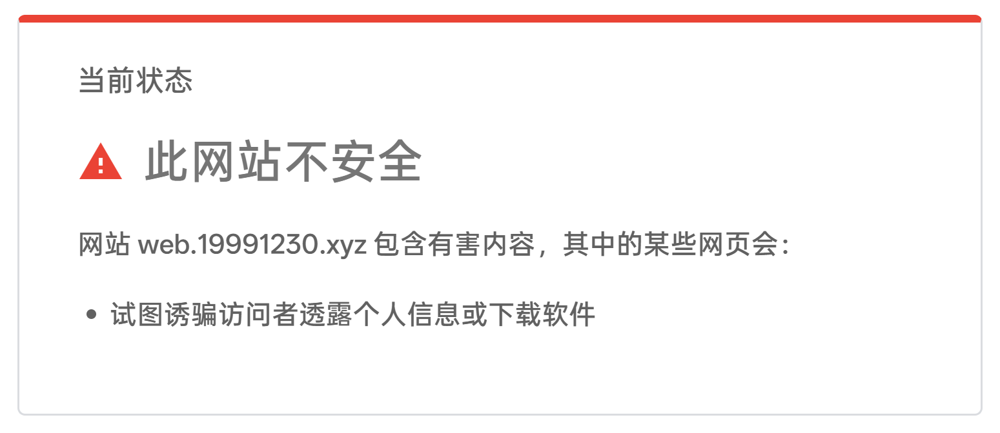
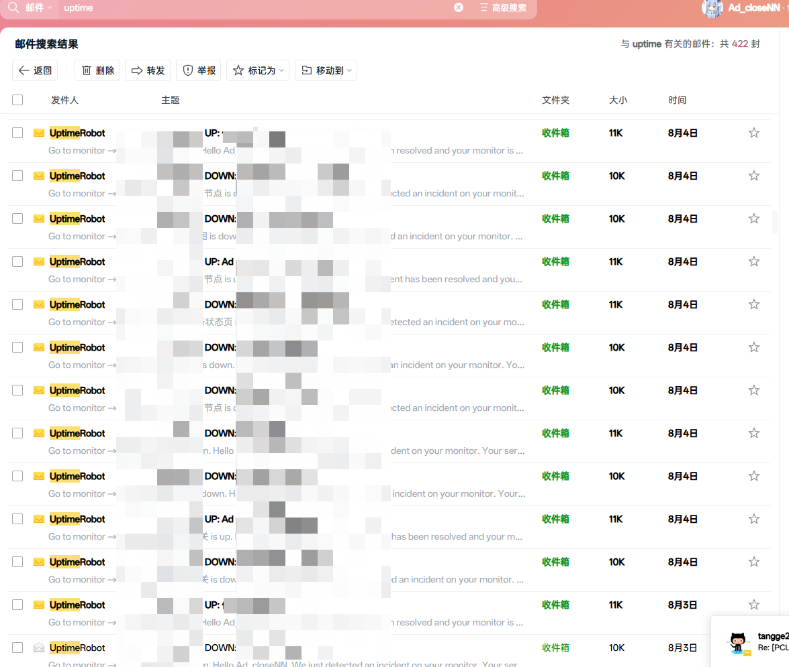

# .xyz 域名
:::note
下面讲的都是[阿里云（国内站）](https://wanwang.aliyun.com/domain)。
:::
之前在[*里云](https://wanwang.aliyun.com/domain)买了个8位纯数字的 `.xyz` 域名，现在买了 `.top` 后觉得特亏。一是在阿里云里面买任何域名都需要实名认证（14+），还得填一些实际身份的信息，我了个去，填完这些信息都够我在 Spaceship 买两次域名了，真是够麻烦的。。。

# .top 域名
买域名后直接开始搭博客，真香~如果不出意外的话，这个域名将会一直用下去。~~毕竟`.top`确实便宜~~

付款的时候甚至不用绑国外卡，能直接用支付宝付款，更不用**实名认证**。另外，Spaceship 的 Web UI 做的是真漂亮、简洁。不过毕竟 Spaceship 是一家 **“ICANN认证的注册商，自2022年以来为客户服务”** 的初创公司，没有隔壁像 [Namesilo（2009）](https://www.namesilo.com)、[Namecheap（2001）](https://www.namecheap.com) 等那么老牌，这么现代的 UI 也挺对。


## 信息
- 来源：[Spaceship](https://www.spaceship.com) （这是真能省钱）
- 域名：[adclosenn.top](/)
- 首年花费：7.33 人民币（汇率：1.00 USD = 7.23002 CNY） 
- 次年花费：29.07 人民币 （¥27.63 域名费+¥1.44 ICANN 费）
- [Whois（阿里云国际站）](https://www.alibabacloud.com/zh/whois): 
```
Domain Name: adclosenn.top
Registry Domain ID: D20250806G10001G_53477846-top
Registrar WHOIS Server: whois.spaceship.com
Registrar URL: http://www.spaceship.com
Updated Date: 2025-08-06T05:28:21Z
Creation Date: 2025-08-06T04:49:06Z
Registrar Registration Expiration Date: 2026-08-06T04:49:06Z
Registrar: Spaceship, Inc.
Registrar IANA ID: 3862
Reseller:
Domain Status: clientTransferProhibited https://icann.org/epp#clientTransferProhibited
Domain Status: addPeriod https://icann.org/epp#addPeriod
Registrant State/Province: Capital Region
Registrant Country: IS
Name Server: malavika.ns.cloudflare.com
Name Server: rustam.ns.cloudflare.com
DNSSEC: unsigned
Registrar Abuse Contact Email: abuse@spaceship.com
Registrar Abuse Contact Phone: +1.16027723958
URL of the ICANN WHOIS Data Problem Reporting System: http://wdprs.internic.net/
```

## 优惠码
这次购买使用的是 `SPSR86`，省了**1.66 人民币**（原价￥8.99）。代码来自 [tld-list.com](https://zh-hans.tld-list.com/%E4%BC%98%E6%83%A0%E7%A0%81)。

---

# 新域名的由来
~~便宜！~~

## 2025/8/2 - 引导
2号晚上，跟着[二叉树树](https://space.bilibili.com/325903362)博客搞起了[TG反代](https://2x.nz/posts/proxy-tgweb/)。脑餐的是，我并没有把登录页面放在子路径下，而是直接暴露在公网上了。之前并不知道子域名可以被扫出来，所以也没做好防护。因为搭建好后并没什么问题，所以直接去睡觉了。

## 2025/8/3 - 预告
早上起来一看发现仍然没问题，TG反代也能正常访问。

起床打开电脑，输入 TGWeb 反代地址，Chrome 直接开出了个大红。嗯，确实是大红。 

不过仍然没收到来自任何关于**钓鱼**、**滥用**的邮件。

飞到 [Google Safe Browsing 透明度报告](https://transparencyreport.google.com/safe-browsing/search) ，一看检查，发现已经被列入了危险列表。 

不过因为是自用的，也就无视风险接着用了。

## 2025/8/4 - 开始
2025年8月4日早上醒来，发现 [UptimeRobot](https://uptimerobot.com) 给我发了很多封邮件，全都是 DOWN 的（突然 UP 的是因为 DNS 等缓存问题，后续全都是 DOWN） 

我立马就意识到不对劲了。用 [itdog](https://www.itdog.cn) 查 NS 记录，发现全都**无解析记录**。后来 Whois 发现域名居然被 XYZ 注册局 **serverHold** 了（[注册局暂停解析](https://www.icann.org/resources/pages/epp-status-codes-2014-06-16-en/#serverHold)）。

马上找到了阿里云开了个工单。阿里云工程师告诉我要自己去 XYZ 注册局的 [gen.xyz/unsuspend](https://gen.xyz/unsuspend) 解决。

由于解决 suspend 需要提供证据：

- “ **Please note that domains will only be reviewed and reactivated when requests are filled out completely and domains have been delisted from all blocklists.** ”

- “ **请注意，仅当请求完整填写并且域名已从所有阻止列表中删除后，才会审核并重新激活域名。** ”

所以我在 `2025/8/7 16:29` 的时候提交部分证据和申请信息到了 [xyzabuse@gen.xyz](mailto:xyzabuse@gen.xyz) 。

## 2025/8/5 - 申诉
早上一起来，UptimeRobot 仍未发送 UP 通知。再看昨天发给 gen.xyz 的邮件，也没有回复我。索性去 [gen.xyz/unsuspend](https://gen.xyz/unsuspend) 解决。

解决前，我把几个安全机构的 Support 都发了一遍邮件，让他们重新检查。回头再看 Google Safe Browsing 透明度报告，`19991230.xyz`及其他除`web.`外的域，都已经变为绿色正常。

16:00 点后，来到 gen.xyz，填了填报告，submit了。而这居然还有坑？

:::warning
当时的情况如此，并非等于现在情况。
:::

1. 网站看起来是不用登录就能 Submit 的，因为下面让你填 **名字** 和 **邮箱**，实际上没登录时，等你 Submit 后会说你未填写用户名和邮箱地址。注册好 XYZ 账号后，再次 Submit 即可成功提交。（吗？
2. 登录 XYZ 账号后 Submit，会返回 ``500 Internal Server Error``，**但实际上貌似已成功发送了你的请求**，真是奇怪。

## 2025/8/6 - 复活
早上再次查看，发现 UptimeRobot 已经发了很多封 UP 邮件。**好耶，域名复活了！**

```
Tuesday, August 5, 2025 - 20:08 PM

XYZ Anti-Abuse Agent 656322, Staff

Subject: Request for Removal of serverHold Status for Domain 19991230.xyz
Subject / Abuse Type:

Hello Ad_closeNN,

Thank you for your message. This domain has been unsuspended and is now active. This domain was flagged by Spamhaus and has since dropped off due to the site being inactive. Please check Spamhaus DBL after 24 hrs to ensure delisting.

Please note that it will be added to a watch list for any potential violations of our anti-abuse policies, and we will continue to monitor this domain.

Also note, it can take up to 24 hours for the WHOIS information to update.

Please submit a new support ticket at https://gen.xyz/abuse if you have any further evidence or information.

Kind Regards,
XYZ Anti-Abuse Team
xyz_abuse@gen.xyz
M-F 9am-5pm PT
```

译文（Google 翻译 ~~生草机~~）
```
2025年8月5日，星期二，晚上8:08

XYZ 反滥用代理 656322，工作人员

主题：请求移除域名 19991230.xyz 的服务器暂停状态
主题/滥用类型：

您好，Ad_closeNN，

感谢您的留言。此域名已解除暂停状态，现已恢复正常。此域名曾被 Spamhaus 标记，由于网站处于非活跃状态，现已下架。请在 24 小时后查看 Spamhaus 的 DBL，以确保将其下架。

请注意，我们将把该域名添加到监视列表中，以查找任何可能违反我们反滥用政策的行为，并持续监控该域名。

另请注意，WHOIS 信息更新可能需要最多 24 小时。

如果您有任何进一步的证据或信息，请访问 https://gen.xyz/abuse 提交新的支持工单。

此致，

XYZ 反滥用团队
xyz_abuse@gen.xyz
周一至周五 上午 9 点至下午 5 点（太平洋时间）
```

然后到了中午，看着旧 `.xyz` 域名，因为这个域名被标记过，之后可能也会被持续严格视奸，所以想到了买一个新的域名。于是到 Namesilo、NameCheap、Spaceship 看，发现英文域名+ `.top` 比较便宜。Google 一搜优惠代码，真找到了个能用的。于是就以 ￥7.33 拿下了 `adclosenn.top` 的首年~~~


# 结语
这件事经历了4天（**8/2**~**8/6**），让我体会到了从域名被 `serverHold` 到 `active` 的过程。

所以...... 搞反代千万不能把登录等敏感页面直接暴露在公网（推荐自用密码+/xxx） 😡😡😡

血一般的教训 😡😡😡 我都没想过会 `serverHold` 😡😡😡 我真的没想过钓鱼 😡😡😡

---
