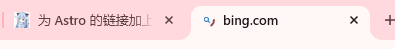

# 前言
看标题可能不明白在说什么。但是如果我放出这两个链接让你点，你应该知道是什么意思。

<a href="https://www.bing.com">打开必应</a> &nbsp; | &nbsp; <a href="https://www.bing.com" target="_blank">在新标签页打开必应</a>

可以看到，第一个按钮是在**当前页面**打开必应，而第二个是在**新标签页**打开必应。如果你用的是手机，那这两种在外观上看不出很大的区别（手机版 Chrome 点击第二个按钮会表现为右上角的标签页个数+1）。但是如果你用的是电脑浏览器，那就很容易看出区别了：   
浏览器开了一个新标签页用于访问必应，这就是我们想要的，因为 Astro 的打开行为是第一个按钮（在本页打开）。下面是这两个按钮的代码：

```html title=打开必应
<a href="https://www.bing.com">打开必应</a>
```
```html title=在新标签页打开必应
<a href="https://www.bing.com" target="_blank">在新标签页打开必应</a>
```

仔细观察，会发现第二个按钮的代码多了一个 `target="_blank"。这个就是控制这个链接的打开方式，如果不写 target 就是默认为当前页面打开，**Astro 就是这样**。 [&lt;a&gt;：锚元素#target - MDN - Mozilla](https://developer.mozilla.org/zh-CN/docs/Web/HTML/Reference/Elements/a#target)

**设想一下，看的教程需要我们打开一个链接操作，但是点了之后，链接就立马在本页打开，教程就被那个链接的新页面覆盖，看不到了。那这时候你要么鼠标中键开链接（快速用新标签页打开链接），要么右键开。不过，还是挺麻烦的吧。**

所以我们需要：**让我们的链接通过新标签页打开，而非在当前页面打开**。

当然，你自己在文章里写 `<a href="https://xxx.com" target="_blank">xxx</a>` 也是一样的效果，但谁又会有这么多时间去写这么一长串的a元素呢？
# 使用插件 rehype-external-links
::github{repo="rehypejs/rehype-external-links"}

:::note[笔记]
即使这个插件的官方 npm 文档 [When should I use this?](https://www.npmjs.com/package/rehype-external-links?activeTab=readme#when-should-i-use-this) 中描述的样例和我们的需求有着天壤之别，但没关系，它的功能已经包含了我们需要的东西。
:::

## 安装插件
假如你的项目使用的包管理器是 pnpm，那就用 pnpm 的命令安装。npm 同理。

```bash title="使用 pnpm 包管理器安装"
pnpm i rehype-external-links
```

```bash title="使用 npm 包管理器安装"
npm i rehype-external-links
```

安装成功后你的 `package.json` 中会新增一个类似于 `"rehype-external-links": "^3.0.0",` 的行：

```json title=package.json ins={2} startLineNumber=50
    "rehype-components": "^0.3.0",
    "rehype-external-links": "^3.0.0",
    "rehype-katex": "^7.0.1",
```

## 配置插件
在根目录的 `astro.config.mjs` 文件内加入以下**5行**代码：
```js title=astro.config.mjs collapse={2-105, 145-177} ins={132-137}
import sitemap from "@astrojs/sitemap";
import svelte from "@astrojs/svelte";
import tailwind from "@astrojs/tailwind";
import { pluginCollapsibleSections } from "@expressive-code/plugin-collapsible-sections";
import { pluginLineNumbers } from "@expressive-code/plugin-line-numbers";
import swup from "@swup/astro";
import expressiveCode from "astro-expressive-code";
import icon from "astro-icon";
import { defineConfig } from "astro/config";
import rehypeAutolinkHeadings from "rehype-autolink-headings";
import rehypeComponents from "rehype-components"; /* Render the custom directive content */
import rehypeKatex from "rehype-katex";
import rehypeSlug from "rehype-slug";
import remarkDirective from "remark-directive"; /* Handle directives */
import remarkGithubAdmonitionsToDirectives from "remark-github-admonitions-to-directives";
import remarkMath from "remark-math";
import remarkSectionize from "remark-sectionize";
import { expressiveCodeConfig } from "./src/config.ts";
import { pluginLanguageBadge } from "./src/plugins/expressive-code/language-badge.ts";
import { AdmonitionComponent } from "./src/plugins/rehype-component-admonition.mjs";
import { GithubCardComponent } from "./src/plugins/rehype-component-github-card.mjs";
import { parseDirectiveNode } from "./src/plugins/remark-directive-rehype.js";
import { remarkExcerpt } from "./src/plugins/remark-excerpt.js";
import { remarkReadingTime } from "./src/plugins/remark-reading-time.mjs";
import { pluginCustomCopyButton } from "./src/plugins/expressive-code/custom-copy-button.js";
import rehypeExternalLinks from 'rehype-external-links';

// https://astro.build/config
export default defineConfig({
	site: "https://adclosenn.top",
	base: "/",
	trailingSlash: "always",
	integrations: [
		tailwind({
			nesting: true,
		}),
		swup({
			theme: false,
			animationClass: "transition-swup-", // see https://swup.js.org/options/#animationselector
			// the default value `transition-` cause transition delay
			// when the Tailwind class `transition-all` is used
			containers: ["main", "#toc"],
			smoothScrolling: true,
			cache: true,
			preload: true,
			accessibility: true,
			updateHead: true,
			updateBodyClass: false,
			globalInstance: true,
		}),
		icon({
			include: {
				"preprocess: vitePreprocess(),": ["*"],
				"fa6-brands": ["*"],
				"fa6-regular": ["*"],
				"fa6-solid": ["*"],
			},
		}),
		expressiveCode({
			themes: [expressiveCodeConfig.theme, expressiveCodeConfig.theme],
			plugins: [
				pluginCollapsibleSections(),
				pluginLineNumbers(),
				pluginLanguageBadge(),
				pluginCustomCopyButton()
			],
			defaultProps: {
				wrap: true,
				overridesByLang: {
					'shellsession': {
						showLineNumbers: false,
					},
				},
			},
			styleOverrides: {
				codeBackground: "var(--codeblock-bg)",
				borderRadius: "0.75rem",
				borderColor: "none",
				codeFontSize: "0.875rem",
				codeFontFamily: "'JetBrains Mono Variable', ui-monospace, SFMono-Regular, Menlo, Monaco, Consolas, 'Liberation Mono', 'Courier New', monospace",
				codeLineHeight: "1.5rem",
				frames: {
					editorBackground: "var(--codeblock-bg)",
					terminalBackground: "var(--codeblock-bg)",
					terminalTitlebarBackground: "var(--codeblock-topbar-bg)",
					editorTabBarBackground: "var(--codeblock-topbar-bg)",
					editorActiveTabBackground: "none",
					editorActiveTabIndicatorBottomColor: "var(--primary)",
					editorActiveTabIndicatorTopColor: "none",
					editorTabBarBorderBottomColor: "var(--codeblock-topbar-bg)",
					terminalTitlebarBorderBottomColor: "none"
				},
				textMarkers: {
					delHue: 0,
					insHue: 180,
					markHue: 250
				}
			},
			frames: {
				showCopyToClipboardButton: false,
			}
		}),
        svelte(),
		sitemap(),
	],
	markdown: {
		remarkPlugins: [
			remarkMath,
			remarkReadingTime,
			remarkExcerpt,
			remarkGithubAdmonitionsToDirectives,
			remarkDirective,
			remarkSectionize,
			parseDirectiveNode,
		],
		rehypePlugins: [
			rehypeKatex,
			rehypeSlug,
			[
				rehypeComponents,
				{
					components: {
						github: GithubCardComponent,
						note: (x, y) => AdmonitionComponent(x, y, "note"),
						tip: (x, y) => AdmonitionComponent(x, y, "tip"),
						important: (x, y) => AdmonitionComponent(x, y, "important"),
						caution: (x, y) => AdmonitionComponent(x, y, "caution"),
						warning: (x, y) => AdmonitionComponent(x, y, "warning"),
					},
				},
			],
			[
				rehypeExternalLinks,
				{
				target: '_blank',
				},
			],
			[
				rehypeAutolinkHeadings,
				{
					behavior: "append",
					properties: {
						className: ["anchor"],
					},
					content: {
						type: "element",
						tagName: "span",
						properties: {
							className: ["anchor-icon"],
							"data-pagefind-ignore": true,
						},
						children: [
							{
								type: "text",
								value: "#",
							},
						],
					},
				},
			],
		],
	},
	vite: {
		build: {
			rollupOptions: {
				onwarn(warning, warn) {
					// temporarily suppress this warning
					if (
						warning.message.includes("is dynamically imported by") &&
						warning.message.includes("but also statically imported by")
					) {
						return;
					}
					warn(warning);
				},
			},
		},
	},
});
```

至此，插件的配置就完成了。随便找个**文章内链接**点击，应该会在**新标签页**打开，而非原来的在当页打开。