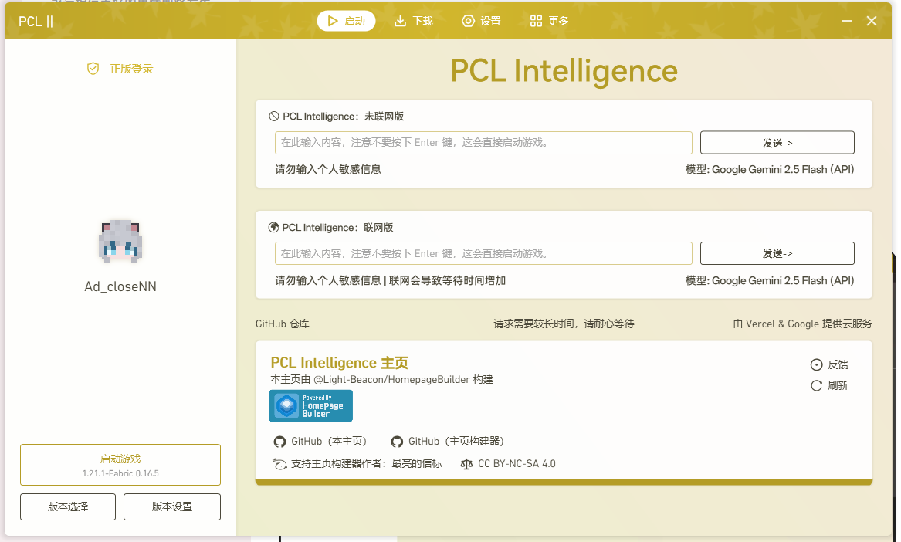
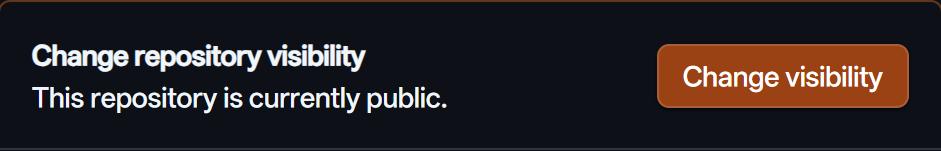
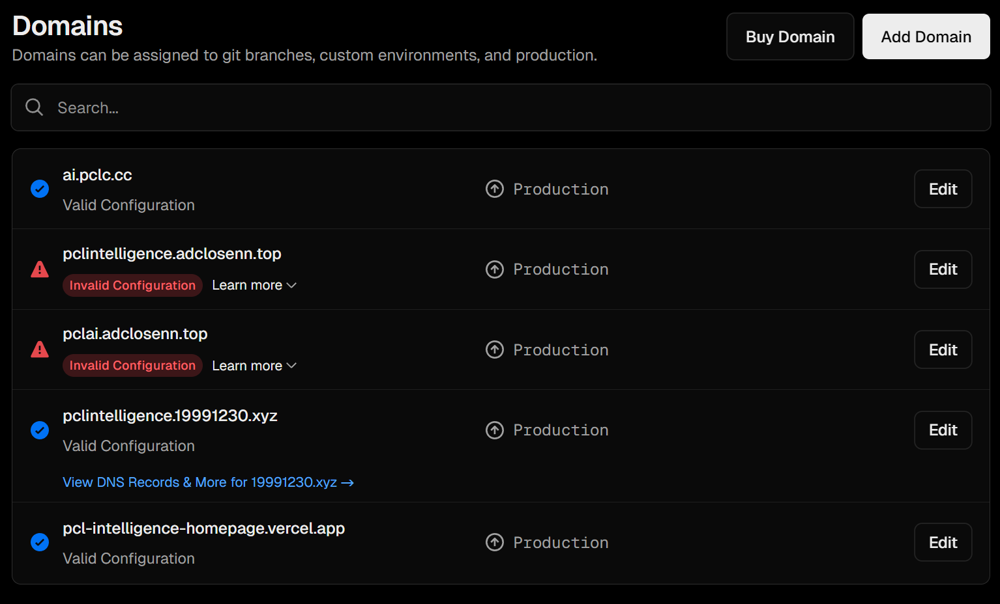
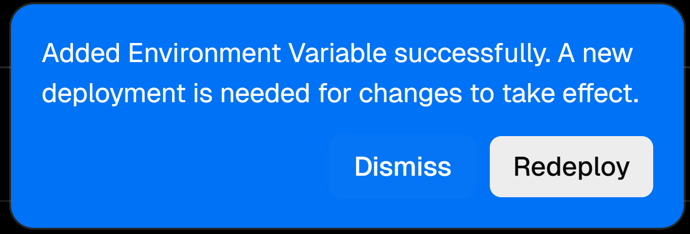
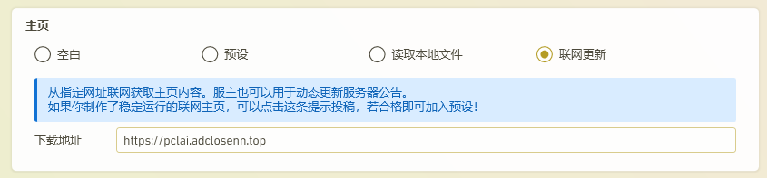

<!-- 小破站防盗链？Referrer 为 localhost 的时候 403 Forbidden -->
<meta name="referrer" content="no-referrer">

# 前言
:::CAUTION[警告]
- 本项目仅供学习交流，请在遵守当地法律法规的情况下使用。中国大陆用户请勿输入政治敏感等违法内容。
- 项目仍在开发中，可能会出现不稳定的现象。
:::

截图：

感谢 [@Light-Beacon/HomepageBuilder](https://github.com/Light-Beacon/HomepageBuilder) 的主页构建器，使得大模型输出的 Markdown 得以构建并输出为 XAML 文件。

::github{repo="Light-Beacon/HomepageBuilder"}

# 需求
- 一个 [Vercel](https://vercel.com/signup) 账号：用于部署主页后端。
- [Google AI Studio API 密钥](https://aistudio.google.com/apikey)（香港地区不支持访问 Google AI Studio）：用于请求模型。
    - 如需请求**单个 API Key**，**Gemini 2.5 Flash** 仅可**每天**调用 250 次；**Gemini 2.5 Pro** 仅可**每天**调用 100 次。
    - 如需请求**多个 API Key** 用于后续的 **[多 API Key 模式](#什么是多-api-key-模式)**，请从[https://console.cloud.google.com/projectcreate](https://console.cloud.google.com/projectcreate) 创建多个项目，后在 AI Studio 中创建 API Key。遇到问题请自行 Google。
- 一个 [GitHub](https://github.com) 账号：用于 Fork 项目。

# 部署
:::CAUTION[警告]
1. 目前仅对 Vercel 平台和 Gemini 模型进行适配，如需使用自己的服务器与其他模型，请自行修改对应文件。
2. 请务必按照以下指示部署你的 PCL Intelligence 主页，不当的操作可能会导致你的 API Key 被**泄露**。
3. 请关注 Vercel Usage 使用情况（位于 [Vercel 主菜单](https://vercel.com) 左侧），需重点关注 `Fluid Active CPU` 和 `Edge Requests` 使用量。不要用超了。更多 Usage Limit 请查看主菜单横条上的 `Usage` 选项。
:::

:::warning[注意]
现在有**两个**部署方式：
- 如果你需要使用 **[多 API Key 模式](#什么是多-api-key-模式)**，请看 **[#多 API Key 模式](#多-api-key-模式)** 。
- （推荐轻度使用）如果你需要使用 **单 API Key 模式** *（一切请求只通过一个 Key 调用）* ，请看 **[#单 API Key 模式](#单-api-key-模式推荐轻度使用)** 。

简单点，  
如果你是轻度**单人使用**，推荐使用 **[#单 API Key 模式](#单-api-key-模式推荐轻度使用)**。  
如果你是**重度**或**多人使用**，推荐使用 **[多 API Key 模式](#什么是多-api-key-模式)**，请看 **[#多 API Key 模式](#多-api-key-模式)**，但请注意不要用超 Vercel 限制。
:::

**这个是前置步骤**：
::github{repo="Ad-closeNN/PCL-Intelligence-Homepage"}
- 来到 GitHub 仓库 [@Ad-closeNN/PCL-Intelligence-Homepage](https://github.com/Ad-closeNN/PCL-Intelligence-Homepage) 或 [点此](https://github.com/Ad-closeNN/PCL-Intelligence-Homepage/fork) Fork 仓库。

## 多 API Key 模式
1. 将 GitHub 仓库的可见性改为 **私密**：
    1. 在仓库顶端点击 **Settings**。
    2. 滑至底部，点击 **Leave fork network** 按钮并确认操作。 
    3. 等待10至30秒，使 Fork 后的仓库脱离 Fork 网络。
    4. 刷新页面，待 **Danger Zone** 里的 **Change visibility** 按钮可用后，点击 **Change visibility** 按钮并确认操作。 
2. 更改 `config/api_key` 文件，删掉原有内容，把从 [Google AI Studio](#需求) 申请的 API Key 以 **一行一个 Key** 的格式填入。
4. 使用 Vercel 部署：[Create New Project](https://vercel.com/new)  
    需要填写相关变量:
    - 填写获取 API Key 的方法：
        - Env Name: `mode`
        - Env Value: `local`
    - 填写请求地址（在 PCL 主页需要通过**点击一个按钮**来向**你所部署的服务器**发送一个请求，所以这个 `请求地址` 需要填写部署好的链接）:
        - Env Name: `link`
        - Env Value：域名或 IP 地址，**必须以 http 开头**
        :::TIP[提示]
        ### 如果不知道怎么填写 `link`，请按照下列指示操作：
        1. 先不填这个变量 `link`。但是上面 `mode` **需要填**，填完**直接部署**。
        2. 部署完成后建议**绑定自定义域名**。也可以尝试做**Vercel 优选**（非必须）。
        3. 来到 Vercel 项目的 **Settings**，在左侧菜单选择 **Environment Variables**。
        4. `Key` 填入 `link`；`Value` 填入 **部署后的链接（优先选有绑定好的自定义域名）**（如`https:/url.pcl-community.org` 或 `https://pih.vercel.app`）**必须带上协议！** 如 `http://` 和 `https://`。  
        关于 `link` 能填什么，例如说，我在 **Domains** 内绑定了几个域名，只有以 `.vercel.app` 结尾的地址是 Vercel 给的，其他剩下的域名是自己的（不包括 `pclc.cc`），所以变量 `link` 就为**除 `vercel.app` 之外的域名**，如 **pclai.adclosenn.top**。如果你不在海外，就不要选带 `vercel.app` 的域名了。 
        5. 点击 `Save` 按钮，保存变量。
        6. 点击右下角弹出的 `Redeploy` 按钮，重新部署 
        :::
5. 部署完成后，就可以把链接填在 PCL 的**自定义主页-联网获取**了。**不要**填我的，要填你部署后用的链接。 

## 单 API Key 模式（推荐轻度使用）
1. 使用 Vercel 部署：[Create New Project](https://vercel.com/new)  
    需要填写相关变量:
    - 填写 API Key：
        - Env Name: `api_key`
        - Env Value: `你的单个 API Key`
    - 填写请求地址（在 PCL 主页需要通过**点击一个按钮**来向**你所部署的服务器**发送一个请求，所以这个 `请求地址` 需要填写部署好的链接）:
        - Env Name: `link`
        - Env Value：域名或 IP 地址，**必须以 http 开头**
        :::TIP[提示]
        ### 如果不知道怎么填写 `link`，请返回查看 [#如果不知道怎么填写 `link` 请按照下列指示操作](#如果不知道怎么填写-link请按照下列指示操作)，无需填写 `mode`！
        :::
2. 部署完成后，就可以把链接填在 PCL 的**自定义主页-联网获取**了。**不要**填我的，要填你部署后用的链接。 

# 其他

:::TIP[提示]
如果你把 `api_key` 和 `mode` 都填了，其使用的顺序为 `mode`>`api_key`（也就是优先使用多个 API Key）。  
如果你什么都不填，或者 `mode` 填的不是 `local` 或 以`http`开头的链接，会报 **500 内部服务器错误**。
:::

# 解答
## 什么是“多 API Key 模式”？
[返回 #需求](#需求) | [返回 #部署](#部署)   
Google Gemini API 有速率限制，详情可以查看这张图片，或直接去 [官网](https://ai.google.dev/gemini-api/docs/rate-limits) 查询：

:::TIP[提示]
**Free Tier**：免费层级\
**RPM**（**R**equests **P**er **M**inute）：每分钟**请求数**\
**TPM**（**T**oken **P**er **M**inute） ：每分钟**输入数**（令牌数）\
**RPD**（**R**equests **P**er **D**ay）：每日**请求数**
:::

单 API Key 每天只能用 **Gemini 2.5 Flash** 250 次。而**每个** API Key 是**单独计算**请求数量的，所以当我们把多个 API Key 一起用的时候就可以请求 `250*n` 次（取决于模型 **RPD** 和 Key **数量**）。