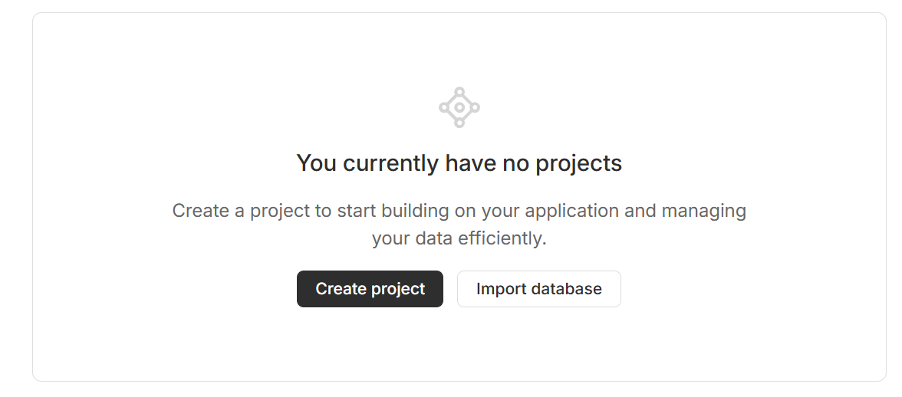
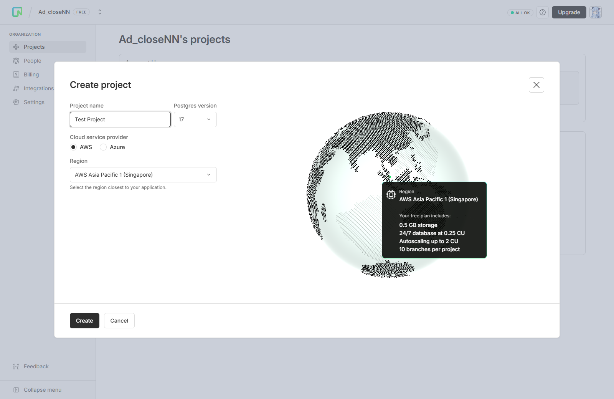
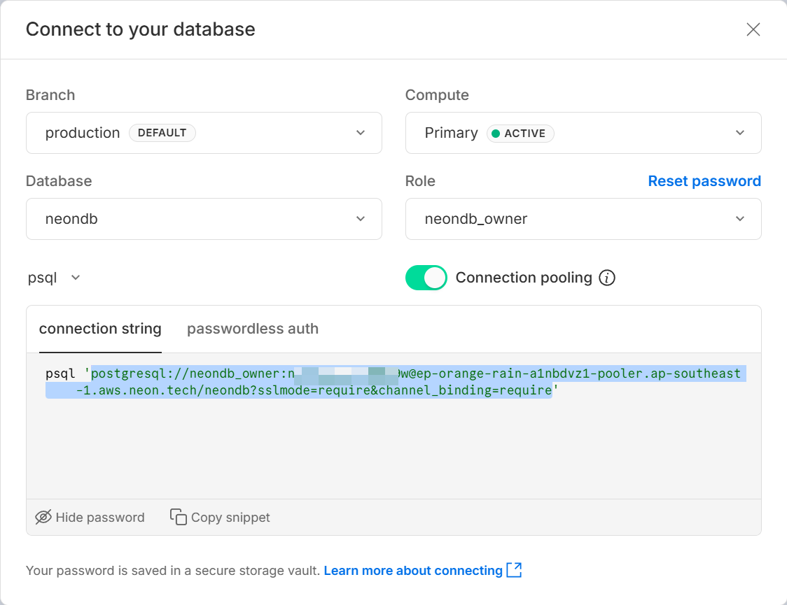
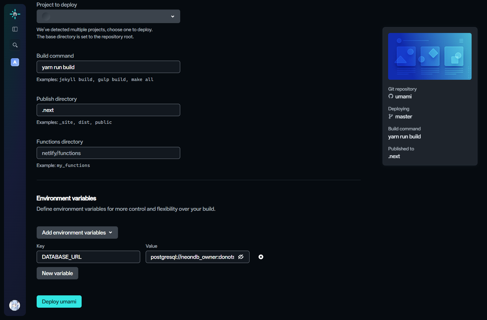
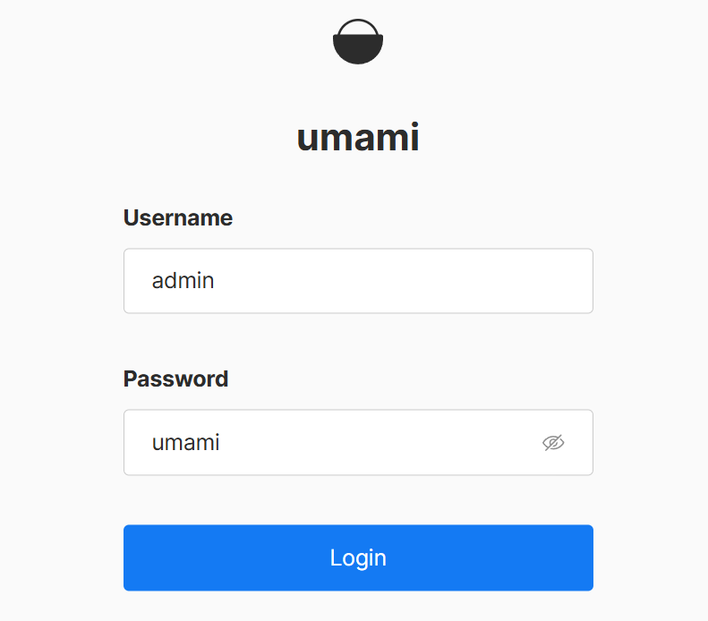
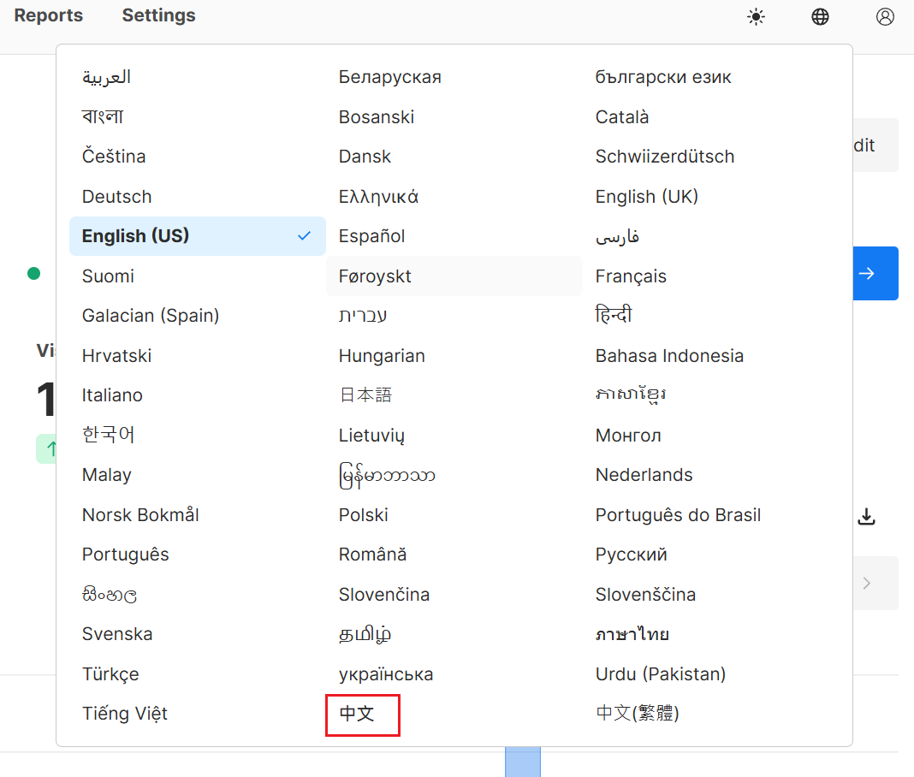

# 自行托管 Umami

## 什么是 Umami
[Umami](https://umami.is) 是一个[开源的](https://github.com/umami-software/umami)的网站统计工具。与 [Google Analytics](https://developers.google.com/analytics) 类似，但比 Google Analytics 的网页 UI 更简洁、精美。

## 为什么要自托管
[Umami](https://umami.is) 可搭配 [Umami Cloud](https://cloud.umami.is/signup) 托管 Umami App。但是这种方式相比自托管有诸多限制：
- 事件：100,000 次/月
- 被分析的网站：3 个/账号
- 数据保留：6 个月
- 有限的 API 访问
- ...更多可在 [umami/pricing](https://umami.is/pricing) 中查看

## 条件
- 一个托管平台账号（任选其一）。本教程以 [Netlify](https://www.netlify.com) 为托管平台演示。
    - [Netlify](https://www.netlify.com) 
    - [Vercel](https://vercel.com)
    - [Cloudflare](https://www.cloudflare.com)
    - [Render](https://render.com)
    - [Railway](https://railway.app)
    - ...等
- 一个 [GitHub](https://github.com) 账号。
- 一个数据库。本教程以 [Neon](https://neon.com) 为数据库演示。
:::warning
Neon 仍有使用限制：[https://neon.com/pricing](https://neon.com/pricing)
- 500 MB 存储空间
:::

## 自托管
1. 来到 [Neon/signup](https://console.neon.tech/signup) 注册一个账号（注册过的直接去到 [console.neon.tech](https://console.neon.tech) ）。
2. 注册后来到 [console.neon.tech](https://console.neon.tech)。
3. 点击 **Create Project** 按钮。 
4. 取一个项目名字，填到 **Project name**。**Cloud service provider** 和 **Region** 随便选一个即可。然后点击 **Create** 按钮创建项目。 
5. 在项目的 **Dashboard** 内点击右上角的 **Connect** 按钮，在 Connect 页面下方点击 **Show password**，将 `psql '` 后，末尾 `'` 前的内容复制下来。 
6. 访问 [@umami-software/umami](https://github.com/umami-software/umami/fork) ，将 umami 仓库 fork 到你的账户下。
7. 访问 [Netlify/start](https://app.netlify.com/start)，在 **Let’s deploy your project with…** 里选择 **GitHub** 并授权到你的 GitHub 账户。
8. 选择刚刚 fork 的 umami 仓库 
9. **Project name** 随便填，**Build Command** 请填写 `yarn run build`（而不是系统给的 `pnpm run build-app`）。
10. 往下找到 **Environment variables**，点击 **Add environment variables**，选择 **Add ket/value pairs**。`Key` 中填写 `DATABASE_URL`，`Value` 填写在 [Neon Console](https://console.neon.tech/) （步骤5）中复制的链接。填写完毕后点击 **Deploy umami** 按钮来部署。 
11. 如果有自定义域名可以绑定自定义域名，优选等一些列步骤。这里就不多赘述了。
12. 访问部署好的 Umami 网页，第一次进入需要输入**默认**账号和密码。登录 Umami 后台成功后请尽快修改密码。
    - **Username**：`admin`
    - **Password**：`umami`
    
13. 登录成功后，可以在右上角切换**显示语言**。 
14. 至此，你已成功自托管一个 Umami 网站统计工具。恭喜你。

# 注意事项
:::caution
Umami 对于从台湾地区传来的请求，默认展示为 **ROC Flag + 台湾**。请注意风险，如需更改，请手动更改 Umami 文件。